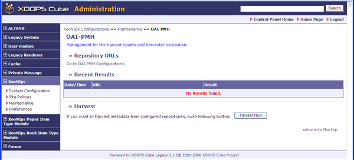

### Tip {#tip}

It is necessary to conduct the following manual operations whenever metadata is to be harvested.

*   &quot;Repository URLs&quot;

    Move to the screen of the repository URL for editing it.

*   &quot;Recent Results&quot;

    Display the latest result.

*   &quot;Harvest&quot;

    Start harvesting by clicking on the [Harvest Now] button.

**Figure�4.29.�&quot;OAI-PMH&quot;**

| � | � | � |
| --- | --- | --- |
| � |   | � |

Last updated: 2011/07/12