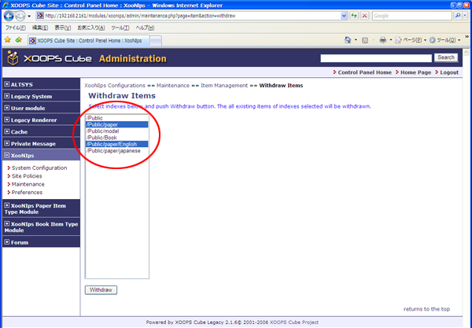
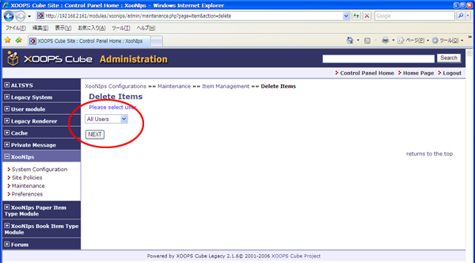
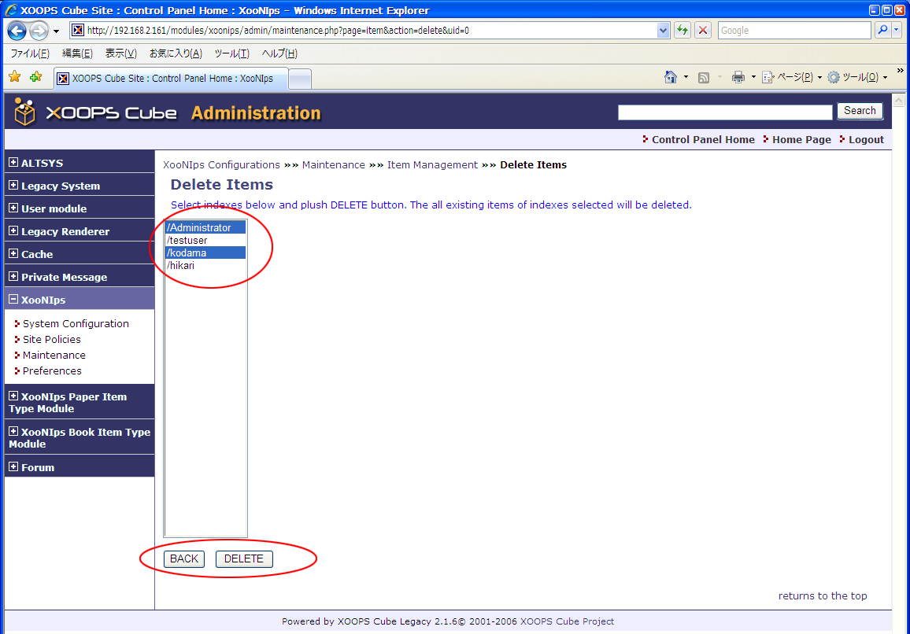
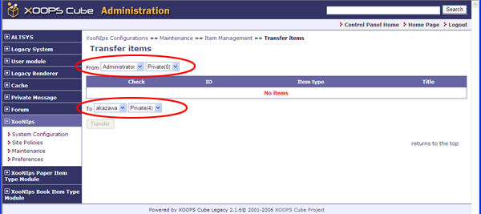
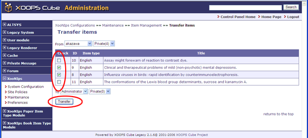
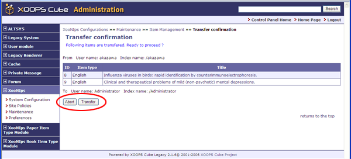

### Tip {#tip}

The item will be withdrawn from the public area, but not be deleted.

**Figure�4.19.�&quot;Withdraw Items&quot;**

#### 2.3.2.�&quot;Delete Items&quot; (XooNIps&gt;&gt;Maintenance&gt;&gt;Item Management&gt;&gt;Delete Items) {#2-3-2-delete-items-xoonips-maintenance-item-management-delete-items}

Delete a user&#039;s items by each index.

Choose a user from the pulldown list and click on [Next].

**Figure�4.20.�&quot;Delete Items&quot;**

Choose an index to be deleted from the pulldown list and click on [DELETE].

**Figure�4.21.�Delete Items 2**

#### 2.3.3.�&quot;Transfer Items&quot; (XooNIps&gt;&gt;Maintenance&gt;&gt;Item Management&gt;&gt;Transfer items) {#2-3-3-transfer-items-xoonips-maintenance-item-management-transfer-items}

The registered items can be modified or deleted by the user who has originally registered them.

If the original user resigns from the site, his/her items can be transferred to another user.

Choose users from the pulldown menu: &quot;From&quot; (the one who transfers the item), &quot;To&quot; (the other who is transferred the item).

**Figure�4.22.�&quot;Transfer Items&quot;**

Check the item to be transferred and click on the [Transfer] button.

**Figure�4.23.�&quot;Transfer Items - 2&quot;**

A confirmation screen will appear. Click on [Transfer] button on the screen.

**Figure�4.24.�&quot;Transfer Item- 3&quot;**