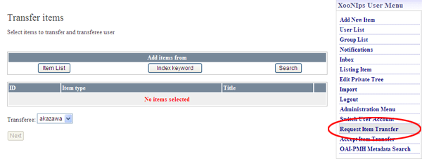
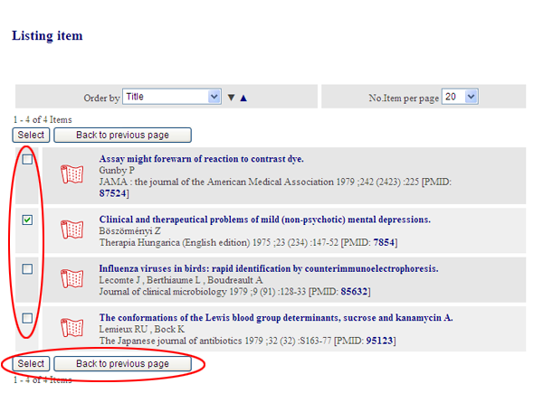
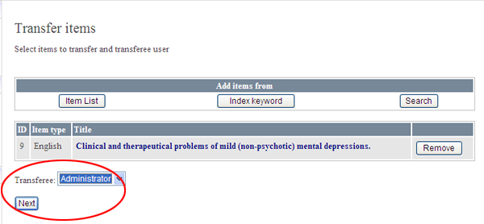
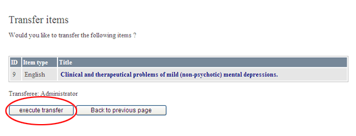
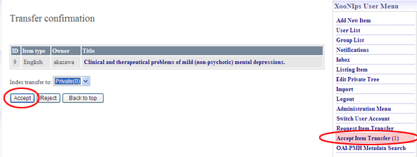

### 2.7. Item transfer {#2-7-item-transfer}

Basically, an item&#039;s edit authority is given only to the user who originally registered/requested to register the item.

When the user resigns from the membership, he/she can transfer their items to another user.

*   How to transfer an item:

    Click on the link [Request Item Transfer] on XooNIps user menu.

    

    **Figure 5.53. &quot;Request Item Transfer&quot;**

    Identify the item to be transferred. Use either of [Item List], [Index keyword], [Search] at &quot;Add items from&quot; for searching it.

    

    **Figure 5.54. Request Item Transfer 2**

    Choose the user who transfers his/her authority (transferee) by the dropdown list and click on the [Next] button.

    

    **Figure 5.55. Request Item Transfer 3**

    A confirmation screen will appear. Click on the [execute transfer] button.

    

    **Figure 5.56. Request Item transfer 4**

*   How to transfer a user&#039;s editing authority to another user:

    Click on the link of &quot;Accept Item Transfer&quot;.

    Choose an index tree keyword to register the transferred item and click on the [Accept] button.

    

    **Figure 5.57. Accept Item Transfer**