### 6.2. Initial setting and confirmation on XooNIps {#6-2-initial-setting-and-confirmation-on-xoonips}

How to set up XooNIps.

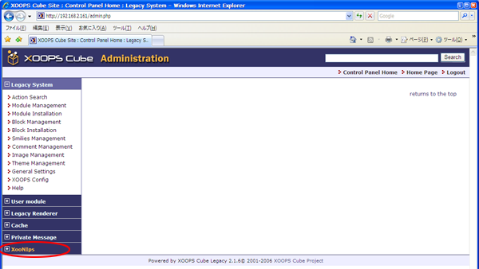

Click on [XooNIps] on the Administration menu.

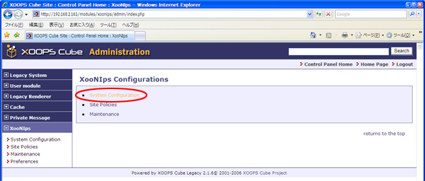

Click on [System Configuration].

#### 6.2.1. Change the file upload directory. {#6-2-1-change-the-file-upload-directory}

Assign a directory where the web server is authorized to write.

 **[root@xoonips-server ~]# mkdir /var/www/xoonipsupload** | ← Create a directory. 
 --- | --- 
 **[root@xoonips-server ~]# chmod a+w /var/www/xoonipsupload** | ← Change permissions. 

Click on [Basic Configuration].

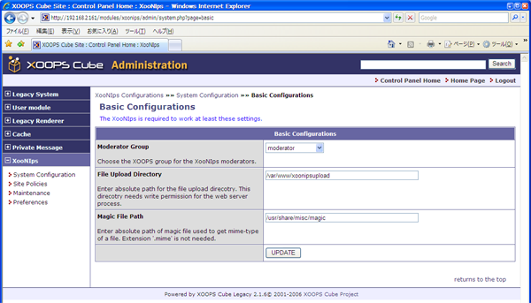

**Enter /var/www/xoonipsupload at [File Upload Directory]**

Click on [UPDATE].

#### 6.2.2. Setup inline frame {#6-2-2-setup-inline-frame}

How to change the display area of an index tree:

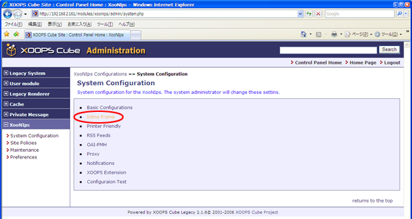

Click on [Inline Frame]

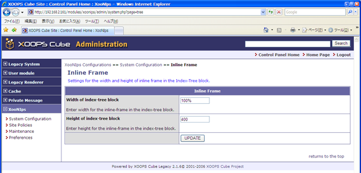

Enter the desired value of width and height of the index tree and click on the [UPDATE] button.

The size of display area within the block can be changed by indicating the width of the index tree in percentage (%).

 Width indicated in 100%. | Width indicated in 50%. 
--- | --- 
 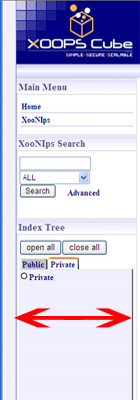 | 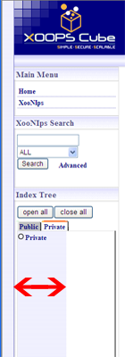 

The range of display area can be changed by indicating the height of the index tree in pixels.

 Height indicated in 400 pixels. | Height indicated in 200 pixels. 
 --- | --- 
  |  

#### 6.2.3. Setup print formats {#6-2-3-setup-print-formats}

How to set the information to be shown as headers on printing:

Click on [Printer Friendly].

The entered information will be printed as a header.

#### 6.2.4. Set up for RSS distribution {#6-2-4-set-up-for-rss-distribution}

XooNIps supports three types of feed formats: RSS1.0(RDF), RSS2.0, Atom1.0

Announcements about newly registered items and the current status within a group can be made by publishing the URL indicated on the &quot;RSS Feeds&quot;.

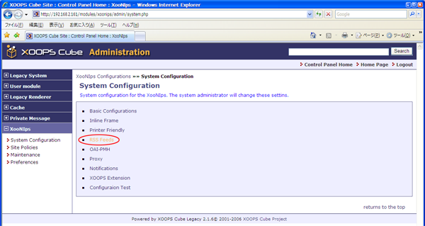

Click on [RSS Feeds]

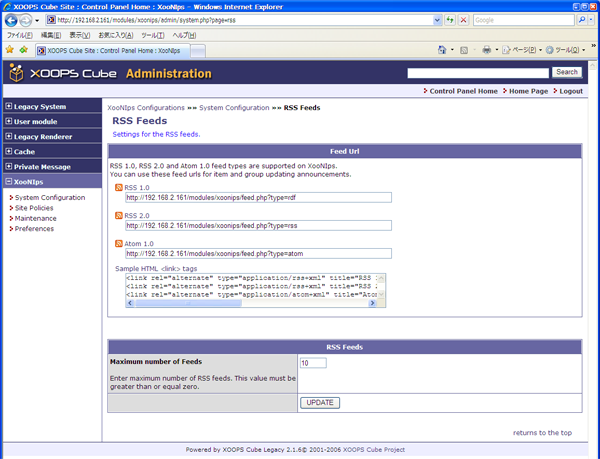

Choose a feed format and copy it to use for publication.

#### 6.2.5. Set up OAI-PMH {#6-2-5-set-up-oai-pmh}

XooNIps adopts OAI-PMH as a structure to automatically collect metadata.

There are two ways: 1\. setup for providing metadata to another server applicable to OAI-PMH. (Repository setup), 2\. setup for harvesting metadata from another server applicable to OAI-PMH (Harvester setup）.

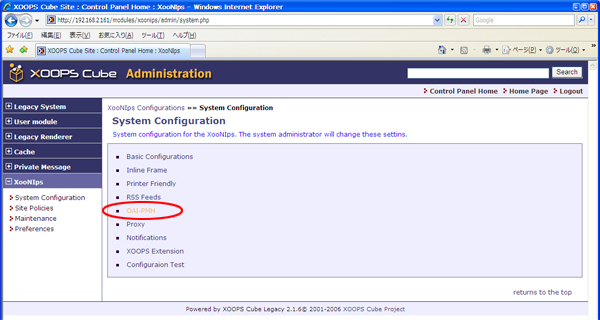

Click on [OAI-PMH].

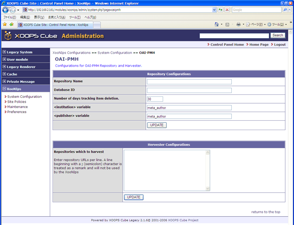

*   &quot;Repository Configurations&quot; is for providing metadata to another server.

    Repository Name | Example：INCF Japan Node XooNIps site 
     --- | --- 
     Database ID | Set identification data by using site name, etc. to distinguish sites. Example: www.neuroinf.jp 
     Number of days for tracking item deletion | Indicate the days for tracking the item deletion. 
     (institution) variable | Set the variable of institution for reply. 
     (publisher) variable | Set the variable of publisher for reply. 

*   The harvester setup is for collecting metadata from another server.

Enter the URLs of the servers for harvesting metadata one by one (press the enter key before entering another URL).

If the line begins with semicolon(;), it is identified as a comment.

#### 6.2.6. Proxy Configuration {#6-2-6-proxy-configuration}

This section explains proxy configurations, which are required in the case of using proxy when accessing from XooNIps to another server.

Click on [Proxy].

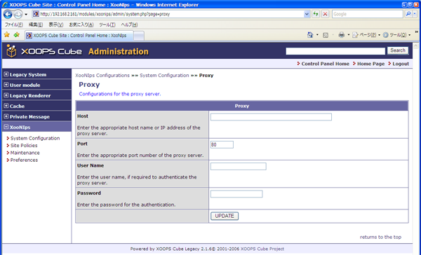

 Host | Enter a host name or IP address of the proxy server. 
 --- | --- 
 Port | Enter the port number of the proxy server. 
 User Name | Enter the user name if required to authenticate the proxy server. 
 Password | Enter the password for authentication. 

#### 6.2.7. Setup for event notification {#6-2-7-setup-for-event-notification}

Decide the kinds of event to be notified to the XooNIps users by using a XOOPS function.

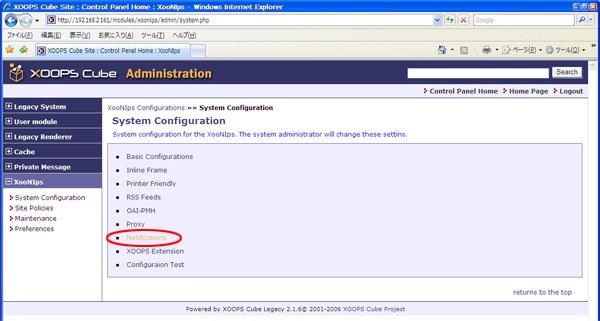

Click on [Notifications].

Choose one from the following.

*   Disable Notification (both styles)

*   Enable only Block-style

*   Enable only Inline-style

*   Enable Notification (both styles)

&quot;Enable Specific Events&quot; accepts multiple choices.

 To whom | Indications at the pulldown menu | Purposes 
 :-: | :-: | :-: 
 Administrator | Administrator: Item transferred | Notify when an item has been transferred. 
| Administrator: Account certified | Notify when an account has been certified. 
| Administrator: Item certified | Notify when a publishing item has been certified. 
| Administrator: Request for group item certification | Notify when there is a request for approval of transferring an item to a group area. 
 User | XooNIps User: Item transferred | Notify when an item has been transferred. 
| XooNIps User: Item updated | Notify when an item has been updated. 
| XooNIps User: Item certified | Notify when a publishing item has been certified. 
| XooNIps User: Item rejected | Notify when a publishing item has been rejected. 
| XooNIps User: File downloaded | Notify when a file has been downloaded. 
| XooNIps User: Group item certified | Notify when an item has been approved of being registered in a group area. 
| XooNIps User: Group item rejected | Notify when an item has been rejected to be registered in a group area. 

#### 6.2.8. XOOPS Extension {#6-2-8-xoops-extension}

Entitle a user to be able to use XooNIps functions if he/she has been registered through the XOOPS user module.

Delete the user information remained on XooNIps if the user was deleted by the XOOPS user module.

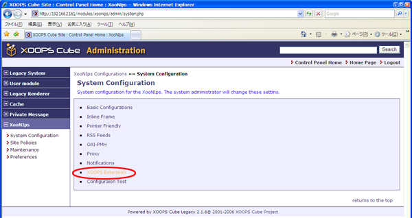

Click on [XOOPS Extension].

Delete or add users by clicking on the icon appeared at &quot;Action&quot;.

#### 6.2.9. Configuration Test {#6-2-9-configuration-test}

How to check the configurations of XooNIps:

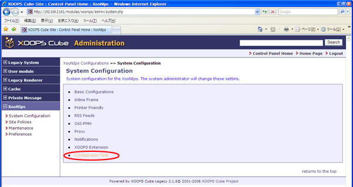

Click on [Configuration Test].

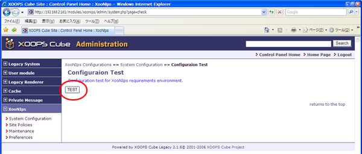

Click on [Test].

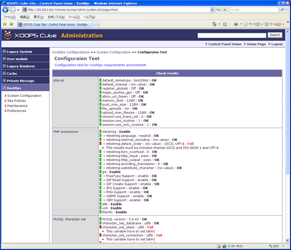

The results of XooNIps system configuration test will be displayed.

If the &quot;Total Result&quot; indicates &quot;OK&quot;, the XooNIps system preparation is successfully completed.

If there are any items indicated in red, it has to be modified as the comment directs.