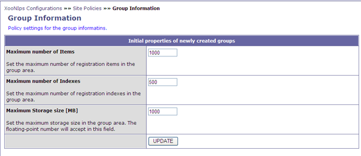

### 1.3. &quot;Group information&quot; (XooNIps -> Site Policies -> Group Information) {#1-3-group-information-xoonips-site-policies-group-information}

Policy settings for the group information (Define the maximum number of items to be registered in a group area and the limit of HDD area to be used by the group).

**Table 4.4. &quot;Initial properties of newly created groups&quot;**

| Category | Description |
| :-- | :-- |
| Maximum number of items | Set the maximum number of items to be registered in a group area. |
| Maximum number of indexes | Set the maximum number of indexes to be registered in a group area. |
| Maximum Storage size | Set the maximum storage size in a group area. |

**Figure 4.3. &quot;Group Information&quot;**