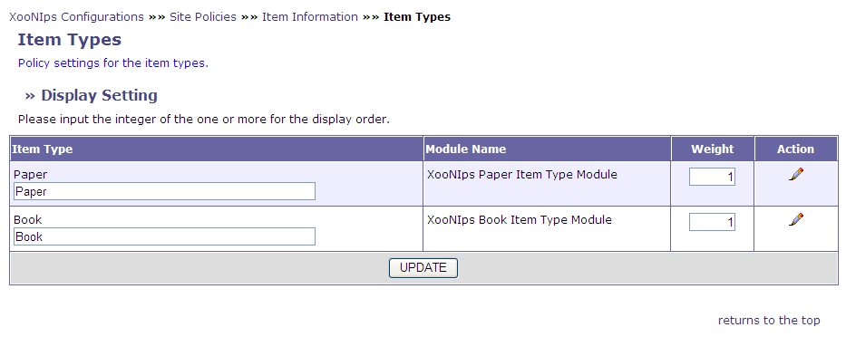
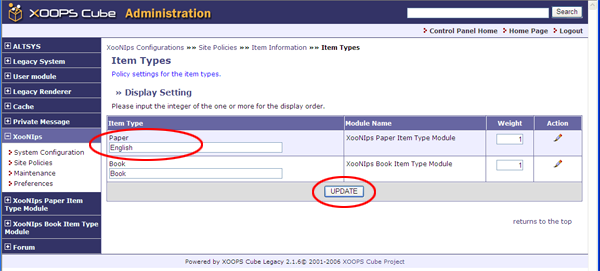
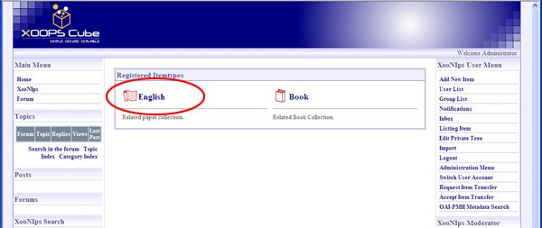

### 1.5. 'Item Types' (XooNIps>>Site Policies>>Item Information>>Item Types) {#1-5-item-types-xoonips-site-policies-item-information-item-types}

How to change the title and order of item types shown on the homepage:

Ex. Change a title Paper to English.

**Figure 4.5. &quot;Dispaly Setting&quot;**

Change Paper to English on the &quot;Display Setting&quot; (XooNIps>>Site Policies>>Item Information>>Item Types).

**Figure 4.6. Display Setting 2**

A title displayed on the homepage will be changed from Paper to English.

**Figure 4.7. Display Setting - 3**