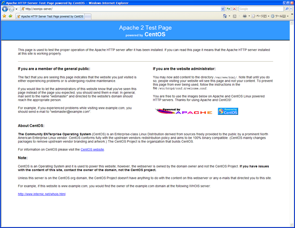

### 4.7.�Set up for Apache {#4-7-set-up-for-apache}

Set up for a web server, Apache.

#### 4.7.1.�Config file editing. {#4-7-1-config-file-editing}

| **[root@xoonips-server ~]# vi /etc/httpd/conf/httpd.conf** | ← Edit config files. |
| --- | --- |
| **AddDefaultCharset UTF-8** |
| ↓ |
| **#AddDefaultCharset UTF-8** | ← Make it as comment. |

#### 4.7.2.�Automatic startup for web server {#4-7-2-automatic-startup-for-web-server}

Set up for making the web server automatically started when the computer is restarted.

| **[root@xoonips-server ~]# /etc/init.d/httpd start** | ← Startup web server. |
| --- | --- |
| **[root@xoonips-server ~]# chkconfig httpd on** | ← Set up for automatic startup for web server. |

#### 4.7.3.�Check the performance of the web server. {#4-7-3-check-the-performance-of-the-web-server}

Startup the browser of another computer and enter the address.

For example: http://(The host name decided when having installed the OS.)/

The setup will be successfully completed if the screen appears as follows:

