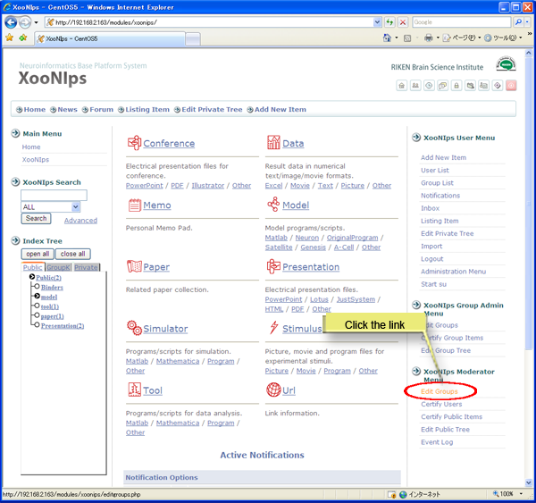
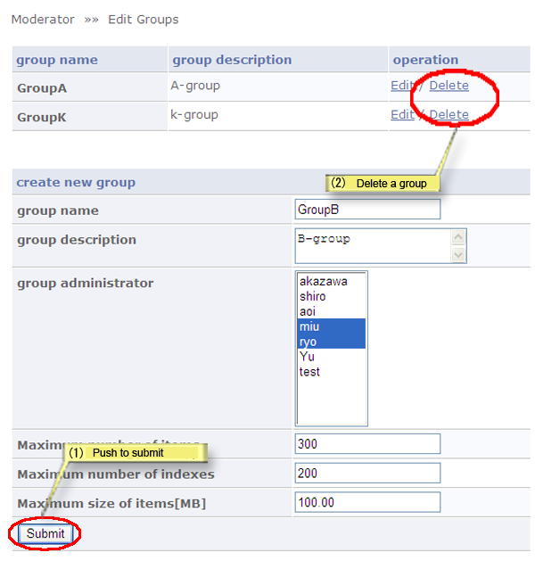

### 4.5. Create/delete a group {#4-5-create-delete-a-group}

How to create/delete a group:

Click on the link [Edit Groups] at the &quot;XooNIps Moderator menu&quot;.

**Figure 5.76. Create/delete a group**

#### 4.5.1. Create/delete a new group {#4-5-1-create-delete-a-new-group}

1.  Create a new group: enter the required information in each field and click on [Submit] button.

2.  Delete a group: click on the link [Delete], and a dialog box will appear. Click on [OK].

*   &quot;Group Name&quot;

    Enter the group&#039;s name.

*   &quot;Group Description&quot;

    Edit the group&#039;s description.

*   &quot;Group Administrators&quot;

    Choose a user as a group administrator (Multiple choice is acceptable).

*   &quot;Maximum number of items&quot;

    Enter the maximum number of the item to be registered in the group area.

*   &quot;Maximum number of indexes&quot;

    Enter the maximum number of the keywords for the group index.

*   &quot;Maximum size of items [MB]&quot;

    Enter the maximum value of data for the group area.

**Figure 5.77. Create/delete a group**

#### 4.5.2. Edit group information {#4-5-2-edit-group-information}

Click on the pen-icon (or [edit] link) on the right side of the intended group.

Click on the [Submit] button to update the information.