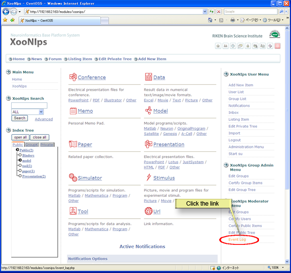
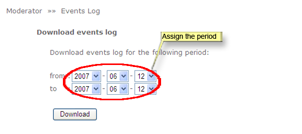
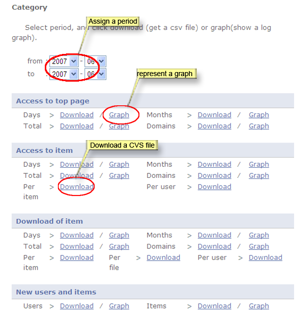
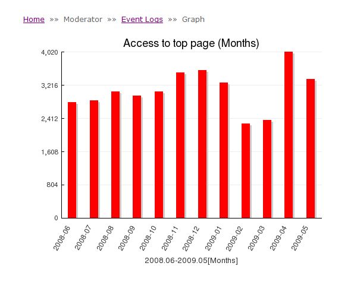

### 4.6.�Access log analysis {#4-6-access-log-analysis}

How to download event logs on XooNIps in a CSV formatted file or transform the data into a graphic chart:

Click on the link [Event Log] at the &quot;XooNIps Moderator&#039;s menu&quot;.

**Figure�5.78.�Even log analysis**

*   Download event logs

    How to download event logs:

    Indicate a period for the intended event logs. The data will be downloaded in CSV formatted file.

    

    **Figure�5.79.�Download event logs by indicating a period**

*   By the event

    Indicate a specific period. Choose &quot;Download&quot; or &quot;Graph&quot; for each category: &quot;Access to top page&quot;, &quot;Access to item&quot;, &quot;Download of item&quot; and &quot;New users and items&quot;.

    

    **Figure�5.80.�Download and graphic chart**

    

    **Figure�5.81.�Event log graphic chart**

*   &quot;Registered Information&quot;

    List the status of registered users and items.