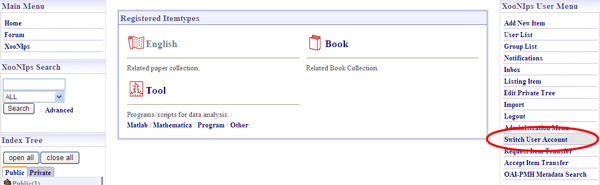
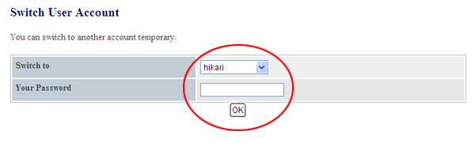
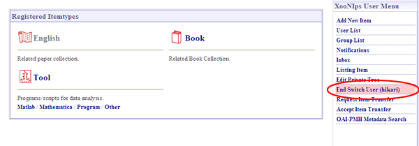

### 5.2.�Switch User Accounts {#5-2-switch-user-accounts}

Basically on XooNIps, the items can be modified only by the user who has originally registered them.

However, system administrators are exclusively entitled to change/modify all the items.

Click on the link [Switch User Account] at &quot;XooNIps User Menu&quot;.

**Figure�5.82.�Switch User Accounts**

Choose a user from the dropdown list and enter the password.

**Figure�5.83.�Switch User Accounts 2**

After completing the procedure, click on the link [End Switch User (user name)] at the XooNIps User Menu.

**Figure�5.84.�Switch User Accounts 3**