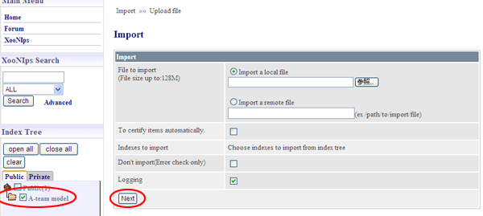
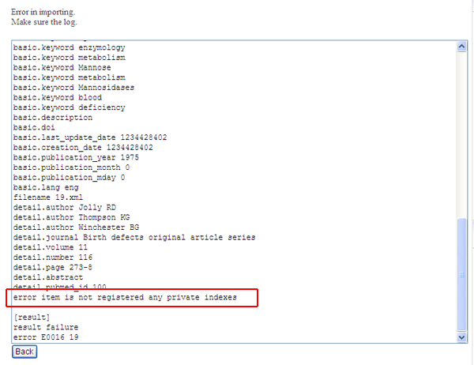
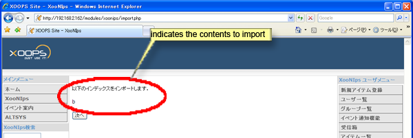

### 5.4.�Import {#5-4-import}

How to load the items and index keywords imported from other XooNIps sites:

Click on the [Import] button at the XooNIps User menu.

**Table�5.1.�Import functions**

| � | Description |
| :-- | :-- |
| &quot;File to import&quot; | Select the file to be imported. |
| &quot;To certify items automatically&quot; | If the item is to be imported to the public area, it will be automatically certified publishing. |
| &quot;Don&#039;t import (Error check only)&quot; | Perform error check but do not import. |
| &quot;Logging&quot; | Show the importing logs. (default) |

Check the checkbox of the index keyword to which an intended file will be imported. Choose the file to be imported and click on the [Next] button.

**Figure�5.91.�Import**

If &quot;logging&quot; is checked and any errors occur, error descriptions will be displayed. Return to the previous screen and modify them.

**Figure�5.92.�Import error log**

If there is no error, click on the import button.

Refrain from unwanted overwriting:

It is subject to confirm whether or not to overwrite the file if it is found to include duplicated keywords or items.

**Figure�5.93.�Refrain from unwanted overwriting**