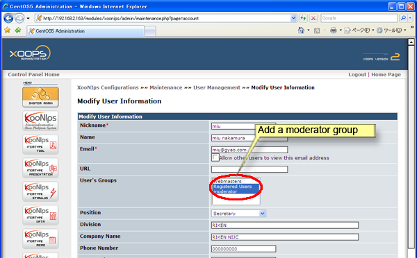

### 5.6.�Change the moderator {#5-6-change-the-moderator}

Go to the &quot;User Management&quot; (&quot;Administration Menu&quot; at &quot;XooNIps User Menu; &quot;XOOPS&gt;&gt;XooNIps&gt;&gt;Maintenance&gt;&gt;User Management). Click on the pen-icon of the intended user to go to the &quot;Modify User Information&quot;. Choose &quot;moderator&quot; at the &quot;User&#039;s Groups&quot; field.

Note: the pulldown menu derives from the &quot;Moderator Group&quot; (&quot;XOOPS&gt;&gt;XooNIps&gt;&gt;System Configuration&gt;&gt;Basic Configurations&gt;&gt;Moderator Group).

**Figure�5.94.�Change the moderator**

| � | � | � |
| --- | --- | --- |
| � |   | � |

Last updated: 2011/07/12