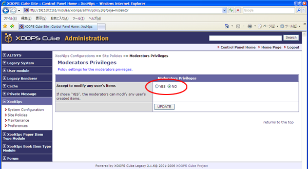

# 1.8. 'Moderators Privileges' \(XooNIps&gt;&gt;Site Policies&gt;&gt;Moderators Privileges\)

Policy settings for the moderators privileges.

If choose yes, the moderators can modify any user's items.

**Figure 4.13. "Moderators Privileges"**

