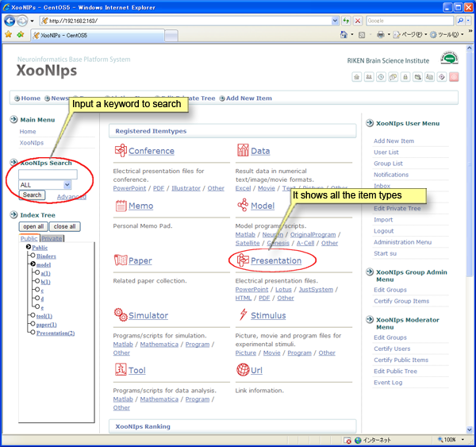
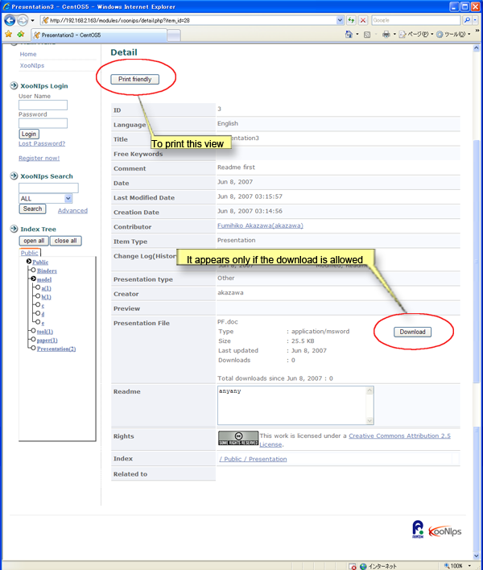
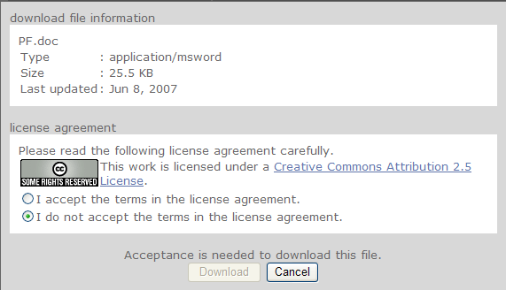

# 1.1. How to search and browse the published items \(information\):

The guest users are permitted to search and browse the registered items in the public area.

A list will be displayed by clicking on an item type \(ex. "Binders", "model" as described\) at the "Index Tree".

"XooNIps Search" is for searching items by item type or metadata.

**Figure 5.1. Home page**

On a "Listing item" screen, the order of the listed items can be changed by the pulldown menu at "Order by". The conditions vary with the item types.

**Figure 5.2. "Listing item" \(search result\)**

On a "Detail" screen, \[Download\] button will appear only if the item is permitted to be downloaded by guest users.

**Figure 5.3. "Detail"**

Downloading will be permitted only if the user agrees with the license condition.

**Figure 5.4. "License agreement"**

