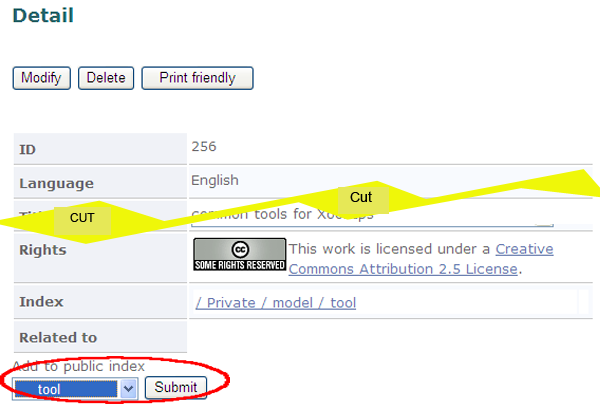

# 2.5. Item publication

To register an item in the public area, it may require to be reviewed by the moderator for approval according to the site policy.

**Figure 5.44. Publishing item flowchart**

## 2.5.1. Publish items 

Go to the "Detail" screen of the item to be published in the Public area, by using "Index Tree" or "XooNIps Search".

Choose an index keyword of the Public area from the "Add to public index" dropdown list at the bottom and click on the \[Submit\].

**Figure 5.45. Publishing item registration screen**

Item publishing may be controlled by the site policy. Therefore, it may require a review to be approved by the moderator.

**Figure 5.46. Publishing item confirmation screen**

