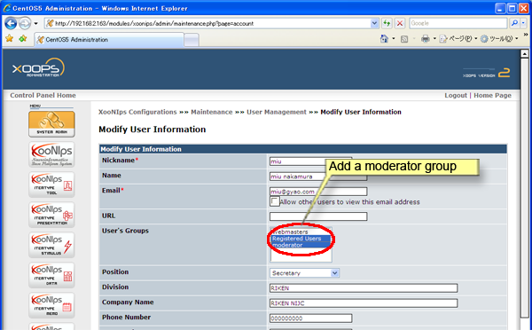

# 5.6. Change the moderator

Go to the "User Management" \("Administration Menu" at "XooNIps User Menu; "XOOPS&gt;&gt;XooNIps&gt;&gt;Maintenance&gt;&gt;User Management\). Click on the pen-icon of the intended user to go to the "Modify User Information". Choose "moderator" at the "User's Groups" field.

Note: the pulldown menu derives from the "Moderator Group" \("XOOPS&gt;&gt;XooNIps&gt;&gt;System Configuration&gt;&gt;Basic Configurations&gt;&gt;Moderator Group\).

**Figure 5.94. Change the moderator**

