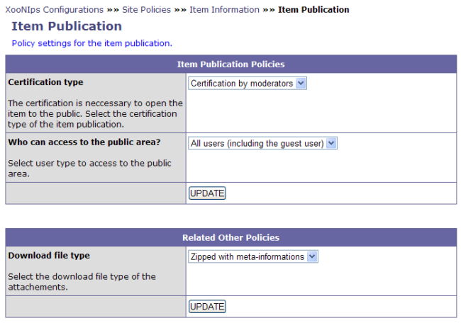

### Tip {#tip}

To update the registered information, click on the submit button for each time.

&quot;Item Publication&quot; (XooNIps&gt;&gt;Site Policies&gt;&gt;Item Information&gt;&gt;Item Publication)

**Table 4.5. &quot;Item Publication Policies&quot;**

| Category | Pulldown menu | Description |
| :-- | :-- | :-- |
| &quot;Certification type&quot; | Certified by moderators | The moderator will certify items. Without being certified, items can not be registered in the public area. |
| Certify automatically | Items will be automatically registered in the public area. |
| &quot;Who can access to the public area?&quot; | All users (including the guest user) | Entitle all users including guest users to download the items. |
| Registered user only | Entitle only registered users to download the items. |

&quot;Related Other Policies&quot; (XooNIps&gt;&gt;Site Policies&gt;&gt;Item Information&gt;&gt;Item Publication)

**Table 4.6. &quot;Related Other Policies&quot;**

| Category | Pulldown menu | Description |
| :-- | :-- | :-- |
| &quot;Download file type&quot; | Zip with meta-information (Recommended) | Download the zipped files with metadata. |
| Original file | Download files in the original format. |

**Figure 4.4. &quot;Item Publication&quot;**