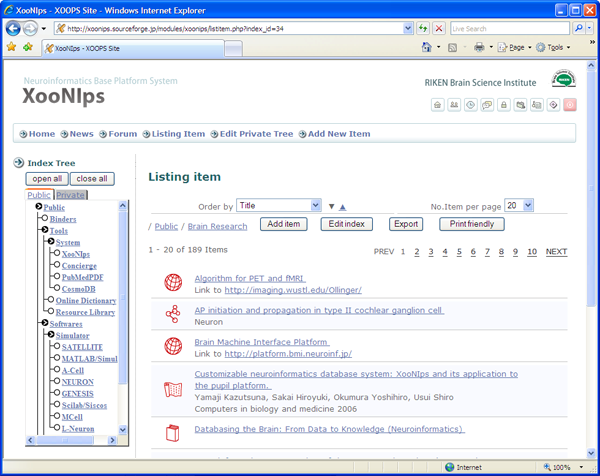

# 2.2. データの分類

## 2.2.1. **アイテムタイプによるデータの分類** 

 XooNIps は12種類の異なったデータフォーマットをアイテムタイプとして用意しています。今後新しいタイプのデータが出てきた場合には新たにアイテムタイプを作成することで対応することが出来ます。

## 2.2.2. **アイテムの分類と整理にはIndex Tree** 

 アイテムはIndexTreeで整理します。IndexTree はアイテムの登録領域毎にPublic、Group、Privateのタブで分類されています。それぞれのタブにはキーワードで細かくアイテムを分類登録することが出来ます。

**Figure 1.3.**  **XooNIpsの基本画面**

## 2.2.3. **データの検索** 

XooNIpsでは以下の検索方法で登録アイテムを検索出来ます

* IndexTreeからの検索
  * 検索したいタブ\(Public、Group、Private）のIndexTreeをクリックすると登録されているアイテムのリストが表示されます。
* Keyword 検索
  * 検索BOXに検索語を入力して検索することも出来ます。
* 詳細検索
  * 更に細かくアイテムタイプを指定して検索を行うことも出来ます。

