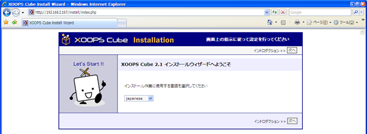
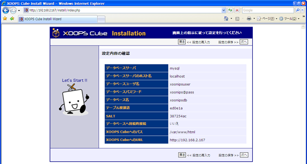
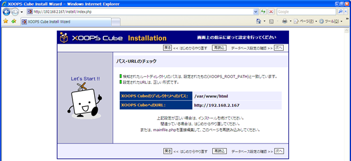
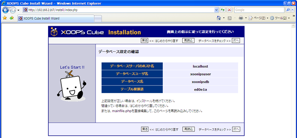
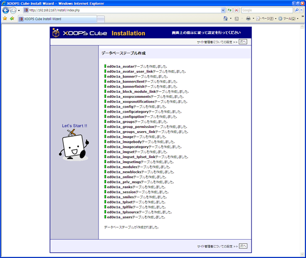
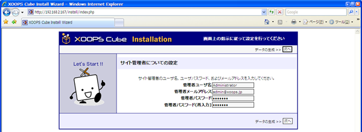
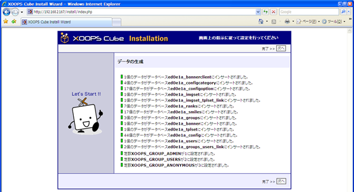
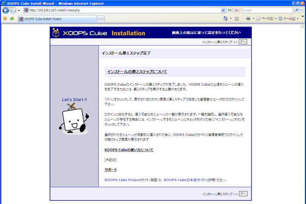
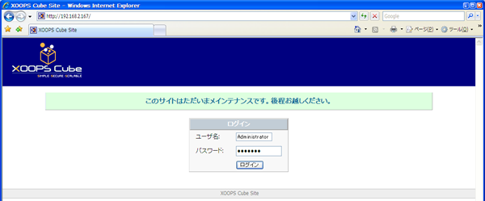
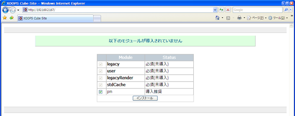

# 5.1. XOOPS Cubeセットアップ

 Webブラウザでhttp://サーバ名/へアクセスをします。

 japaneseを選択して\[次へ\]をクリックします。

 \[次へ\]をクリックします。

 \[次へ\]をクリックします。

MySQLの設定で作成したデータベースユーザ名・データベースパスワード・データベース名を入力します。

空欄へ以下の情報を入力して\[次へ\]をクリックします。

| データベースユーザ名 | xoonipsuser |
| :--- | :--- |
| データベースパスワード | xoonips@pass |
| データベース名 | xoonipsdb |

 \[次へ\]をクリックします。

 \[次へ\]をクリックします。

 \[次へ\]をクリックします。

 \[次へ\]をクリックします。

 \[次へ\]をクリックします。

 \[次へ\]をクリックします。

以下の情報を入力して\[次へ\]をクリックします。

ここで作成するのはXOOPS Cubeを管理するユーザです。

CentOSのユーザやMySQLのユーザとは別のものになります。

| 管理者ユーザ名 | XOOPS Cubeサイト管理者ユーザ名\(例はAdministrator\) |
| :--- | :--- |
| 管理者メールアドレス | XOOPS Cubeサイト管理者メールアドレス\(例はadmin@xoonips.jp\) |
| 管理者パスワード | パスワード |
| 管理者パスワード\(再入力\) | パスワード |

 \[次へ\]をクリックします。

 \[次へ\]をクリックします。

 XOOPS Cubeの管理者ユーザ名とパスワードを入力して\[ログイン\]をクリックします。

 インストールボタンをクリックします。

インストール完了です。

Webブラウザを一度終了してください。

