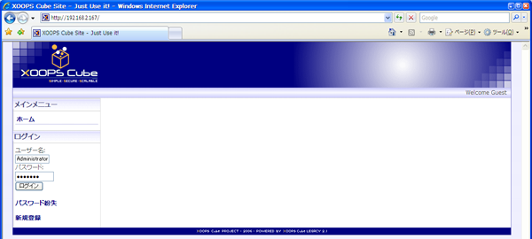
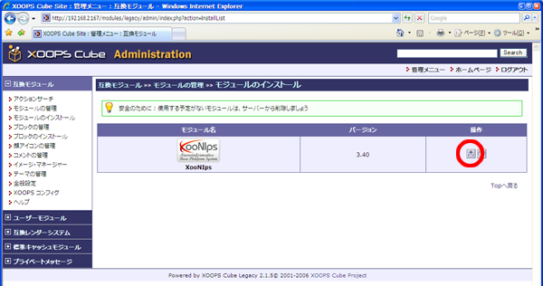
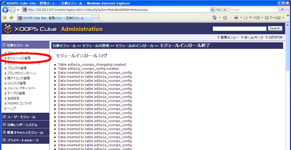
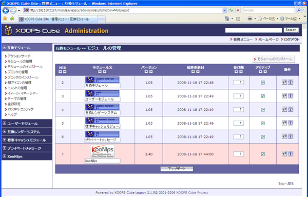

# 6.1. XooNIpsセットアップ

 Webブラウザでhttp://サーバ名/へアクセスをします。

 情報を入力してログインボタンをクリックします。

| ユーザ名 | 管理者ユーザ名\(例はAdministrator\) |
| :--- | :--- |
| パスワード | 管理者パスワード |

 \[管理者メニュー\]をクリックします。

 \[モジュールのインストール\]をクリックします。

 操作欄にあるインストールアイコンをクリックします。

 インストールボタンをクリックします。

 \[モジュールの管理\]をクリックします。

 XooNIpsのインストールが正常に行われていればこの様な画面になります。

