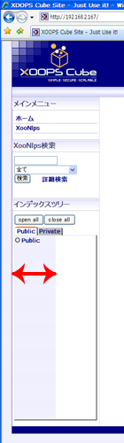
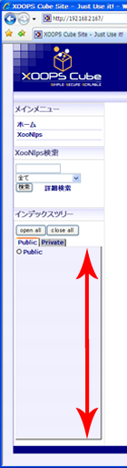
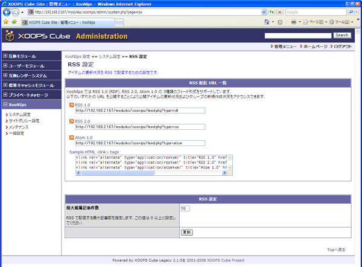
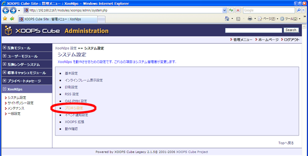
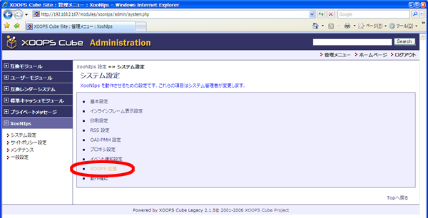
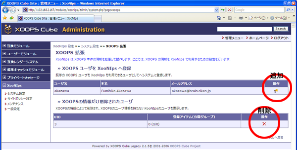

# 6.2. XooNIpsの初期設定と確認

 XooNIpsを使用するための設定をします。

 管理者メニューで\[XooNIps\]をクリックします。

 \[システム設定\]をクリックします。

## 6.2.1. **ファイルアップロードディレクトリの変更** 

Webサーバの権限で書き込みが出来るディレクトリを指定する必要があります。

| `[root@xoonips-server ~]#` **mkdir /var/www/xoonipsupload** | ← ディレクトリを作成 |
| :--- | :--- |
| `[root@xoonips-server ~]#` **chmod a+w /var/www/xoonipsupload** | ← パーミッションを変更する。 |

|  |
| :--- |

 \[基本設定\]をクリックします。

\[ファイルアップロードディレクトリ\]の項目に**/var/www/xoonipsupload**と入力します。

更新ボタンをクリックして変更した設定を有効にします。

## 6.2.2. **インラインフレーム設定** 

 ここではインデックスツリーの表示領域を変更することが出来ます。

 \[インラインフレーム表示設定\]をクリックします。

インデックスツリーの幅とインデックスツリーの高さを数値で入力して更新ボタンを押します。

インデックスツリーの幅を割合（％）で指定することによりブロック内での表示領域の割合を変更できます。

| Width indicated in 100%. | Width indicated in 50%. |
| :--- | :--- |
|  |  |

 インデックスツリーの高さをピクセルで指定することにより表示領域の大きさを変更できます。

| Height indicated in 400 pixels. | Height indicated in 200 pixels. |
| :--- | :--- |
|  |  |

## 6.2.3. **印刷設定** 

 ここではページを印刷する際にヘッダとして表示させる情報を入力することが出来ます。

 \[印刷設定\]をクリックします。

 入力した情報は詳細画面などを印刷の際ヘッダ情報として同時に印刷されます。

## 6.2.4. **RSS配信設定** 

XooNIpsはRSS1.0\(RDF\)、RSS2.0、Atom1.0の３種類のフィード形式をサポートしています。

設定画面で表示されるURLを公開することでアイテムの更新情報及びグループの新規作成状況がアナウンス出来ます。

 \[RSS設定\]をクリックします。

 利用するフィード形式のテキストボックスの内容をコピーして公開してください。

## 6.2.5. **OAI-PMH設定** 

XooNIpsはメタデータの情報を機械的に収集する仕組みとしてOAI-PMHを採用しています。

ここではOAI-PMHに対応した別のサーバにメタデータを提供するための設定（リポジトリ設定）とOAI-PMHに対応した別のサーバからメタデータを収集するための設定（ハーベスタ設定）の両方が行えます。.

 \[OAI-PMH設定\]をクリックします。

*  リポジトリ設定はメタデータを他のサーバに提供する為の設定です。

<table>
  <thead>
    <tr>
      <th style="text-align:left">
        

        <ul>
          <li>
            <table>
              <thead>
                <tr>
                  <th style="text-align:left">&#x30EA;&#x30DD;&#x30B8;&#x30C8;&#x30EA;&#x540D;</th>
                  <th style="text-align:left">&#x4F8B;&#xFF1A;INCF Japan Node XooNIps site</th>
                </tr>
              </thead>
              <tbody>
                <tr>
                  <th style="text-align:left">&#x30C7;&#x30FC;&#x30BF;&#x30D9;&#x30FC;&#x30B9;ID</th>
                  <th style="text-align:left">&#x30B5;&#x30A4;&#x30C8;&#x540D;&#x7B49;&#x3092;&#x5229;&#x7528;&#x3057;&#x3066;&#x30B5;&#x30A4;&#x30C8;&#x3092;&#x533A;&#x5225;&#x3059;&#x308B;&#x305F;&#x3081;&#x306E;&#x8B58;&#x5225;&#x5B50;&#x3092;&#x8A2D;&#x5B9A;&#x3057;&#x307E;&#x3059;&#x3002;&#x4F8B;&#xFF1A;www.neuroinf.jp</th>
                </tr>
                <tr>
                  <th style="text-align:left">&#x30A2;&#x30A4;&#x30C6;&#x30E0;&#x306E;&#x524A;&#x9664;&#x72B6;&#x614B;&#x3092;&#x4FDD;&#x5B58;&#x3059;&#x308B;&#x65E5;&#x6570;</th>
                  <th
                  style="text-align:left">&#x30A2;&#x30A4;&#x30C6;&#x30E0;&#x3092;&#x524A;&#x9664;&#x3057;&#x305F;&#x3068;&#x3044;&#x3046;&#x60C5;&#x5831;&#x306E;&#x4FDD;&#x5B58;&#x65E5;&#x6570;&#x3092;&#x6307;&#x5B9A;&#x3057;&#x307E;&#x3059;&#x3002;</th>
      </tr>
      <tr>
        <th style="text-align:left">institution&#x306E;&#x5024;</th>
        <th style="text-align:left">OAI-PMH&#x306E;&#x5FDC;&#x7B54;&#x306B;&#x5FC5;&#x8981;&#x306A;institution&#x306E;&#x5024;&#x3092;&#x8A2D;&#x5B9A;&#x3057;&#x307E;&#x3059;&#x3002;</th>
      </tr>
      <tr>
        <th style="text-align:left">publisher&#x306E;&#x5024;</th>
        <th style="text-align:left">OAI-PMH&#x306E;&#x5FDC;&#x7B54;&#x306B;&#x5FC5;&#x8981;&#x306A;publisher&#x306E;&#x5024;&#x3092;&#x8A2D;&#x5B9A;&#x3057;&#x307E;&#x3059;&#x3002;</th>
      </tr>
      </tbody>
      </table>
      </li>
      <li>&#x30CF;&#x30FC;&#x30D9;&#x30B9;&#x30BF;&#x8A2D;&#x5B9A;&#x306F;&#x30E1;&#x30BF;&#x30C7;&#x30FC;&#x30BF;&#x3092;&#x4ED6;&#x306E;&#x30B5;&#x30FC;&#x30D0;&#x304B;&#x3089;&#x53CE;&#x96C6;&#x3059;&#x308B;&#x305F;&#x3081;&#x306E;&#x8A2D;&#x5B9A;&#x3067;&#x3059;&#x3002;</li>
      </ul>
      
&#x30E1;&#x30BF;&#x30C7;&#x30FC;&#x30BF;&#x3092;&#x53CE;&#x96C6;&#x3059;&#x308B;&#x30B5;&#x30FC;&#x30D0;&#x306E;URL&#x3092;&#x6539;&#x884C;&#x533A;&#x5207;&#x308A;&#x3067;&#x5165;&#x529B;&#x3057;&#x307E;&#x3059;&#x3002;

      
&#x884C;&#x306E;&#x5148;&#x982D;&#x306B;(&#x30BB;&#x30DF;&#x30B3;&#x30ED;&#x30F3;);&#x3092;&#x4ED8;&#x3051;&#x305F;&#x5834;&#x5408;&#x306F;&#x305D;&#x306E;&#x884C;&#x306F;&#x30B3;&#x30E1;&#x30F3;&#x30C8;&#x306B;&#x306A;&#x308A;&#x307E;&#x3059;&#x3002;

      </th>
    </tr>
  </thead>
  <tbody></tbody>
</table>

## 6.2.6. **プロキシ設定** 

 XooNIpsから他のサーバへアクセスする際プロキシを利用する場合に設定します。

 \[プロキシ設定\]をクリックします。

| ホスト名 | プロキシサーバのホスト名を設定します |
| :--- | :--- |

| ポート番号 | プロキシサーバのポート番号を設定します |
| :--- | :--- |

| ユーザ名 | ユーザ認証が必要な場合にユーザ名を設定します |
| :--- | :--- |

| パスワード | ユーザ認証のパスワードを設定します |
| :--- | :--- |

## 6.2.7. **イベント通知設定** 

 XOOPSが本来持っているイベント通知機能を利用してXooNIpsがユーザに対して伝えることの出来るイベントを指定します。

\[イベント通知設定\]をクリックします。

イベント通知設定は以下の４つから選択します。

* この機能を無効にする
* イベント選択オプションをブロックに表示する
* イベント選択オプションをメインコンテンツ下部に表示する
* イベント選択オプションをブロックおよびメインコンテンツ下部の両方に表示する

特定イベントを有効にするの項目は複数の選択が可能です。

| 通知する相手 | 画面での表示 | 設定される内容 |
| :--- | :--- | :--- |
| XooNIps管理者 | 管理者：アイテム移譲通知 | アイテムが移譲されたことを通知します。 |
| 管理者：アカウント承認通知 | アカウントが承認されたことを通知します。 |  |
| 管理者：アイテム承認通知 | 公開アイテムが承認されたことを通知します。 |  |
| 管理者：グループアイテム承認要求通知 | グループ領域へのアイテム承認要求があることを通知します。 |  |
| ユーザ | XooNIpsユーザ：アイテム移譲通知 | アイテムが移譲されたことを通知します。 |
| XooNIpsユーザ：アイテム更新通知 | アイテムが更新されたことを通知します。 |  |
| XooNIpsユーザ：アイテム承認通知 | 公開アイテムが承認されたことを通知します。 |  |
| XooNIpsユーザ：アイテム承認拒否通知 | 公開アイテムの承認が拒否されたことを通知します。 |  |
| XooNIpsユーザ：ファイルのダウンロードを通知 | ファイルがダウンロードされたことを通知します。 |  |
| XooNIpsユーザ：グループアイテム承認通知 | グループ領域に登録したアイテムが承認されたことを通知します。 |  |
| XooNIpsユーザ：グループアイテム承認拒否通知 | グループ領域へのアイテム登録が拒否されたことを通知します。 |  |

## 6.2.8. **XOOPS拡張** 

XOOPSのユーザーモジュールでユーザの登録を行った場合、そのユーザがXooNIpsの機能を使えるようにします。

XOOPSのユーザーモジュールでユーザの削除を行った場合、XooNIpsに残っているユーザ情報を削除します。

 \[XOOPS拡張\]をクリックします。

 操作欄にあるアイコンをクリックすることでユーザの追加や削除が行えます。

## 6.2.9. **動作確認** 

 XooNIpsの動作設定を確認します。

 \[動作確認\]をクリックします。

 \[テスト\]をクリックします。

XooNIpsの設定情報が表示されます。

総合判定がOKになっていればXooNIps動作前の設定は終了です。

赤色で表示された場所がある場合には、画面のコメントに従って修正する必要があります。

