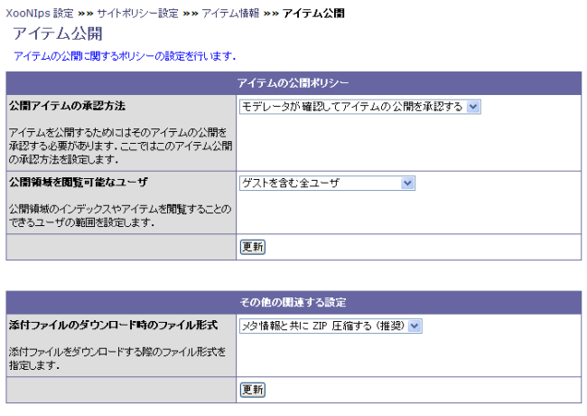

# 1.4. アイテム情報

アイテムに関する設定です

#### Tip

情報を反映させるためにはそれぞれのsubmitボタンを押す必要があります。

アイテム公開

**Table 4.5. アイテムの公開ポリシー**

| 項目 | 選択肢 | 説明 |
| :--- | :--- | :--- |
| 公開アイテムの承認方法 | モデレータが確認してアイテムの公開を承認する | 承認作業をモデレーターが行います。承認されないとアイテムは公開領域に登録されません。 |
| 自動的にアイテムの公開を承認する | 承認作業を行いません。アイテムは直ぐに公開領域に登録されます。 |  |
| 公開領域を閲覧可能なユーザ | ゲストを含む全ユーザ | XooNIpsに登録していないゲストユーザーも含め全てのユーザーがアイテムをダウンロード出来ます。 |
| XooNIpsに登録されたユーザのみ | XooNIpsに登録している登録ユーザーのみアイテムをダウンロードできます。 |  |

その他の関連する設定

**Table 4.6. その他の関連する設定**

| 項目 | 選択肢 | 説明 |
| :--- | :--- | :--- |
| 添付ファイルのダウンロード時のファイル形式 | メタ情報と共にZIP圧縮する（推奨） | メタデータを含めてZIP圧縮したファイルをダウンロードします。 |
| オリジナルのまま | アイテムのオリジナルファイル形式のままダウンロードします。 |  |

**Figure 4.4. アイテム公開**

