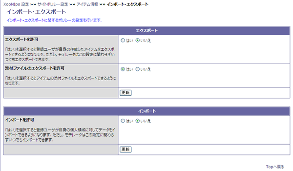

# 1.6. インポートエクスポート

インポート・エクスポートに関する設定です

* エクスポート

  エクスポートに関する設定です。

  **Table 4.7. Related Other Policies**

  <table>
    <thead>
      <tr>
        <th style="text-align:left">&#x9805;&#x76EE;</th>
        <th style="text-align:left">&#x8AAC;&#x660E;</th>
      </tr>
    </thead>
    <tbody>
      <tr>
        <td style="text-align:left">&#x30A8;&#x30AF;&#x30B9;&#x30DD;&#x30FC;&#x30C8;&#x3092;&#x8A31;&#x53EF;</td>
        <td
        style="text-align:left">
          
&#x30A8;&#x30AF;&#x30B9;&#x30DD;&#x30FC;&#x30C8;&#x306E;&#x8A31;&#x53EF;&#x8A2D;&#x5B9A;&#x3067;&#x3059;&#x3002;

          
&#x306F;&#x3044;&#x3092;&#x9078;&#x629E;&#x3059;&#x308B;&#x3068;&#x3001;&#x767B;&#x9332;&#x30E6;&#x30FC;&#x30B6;&#x30FC;&#x304C;&#x81EA;&#x5206;&#x306E;&#x4F5C;&#x6210;&#x3057;&#x305F;&#x30A2;&#x30A4;&#x30C6;&#x30E0;&#x3092;&#x30A8;&#x30AF;&#x30B9;&#x30DD;&#x30FC;&#x30C8;&#x51FA;&#x6765;&#x308B;&#x3088;&#x3046;&#x306B;&#x306A;&#x308A;&#x307E;&#x3059;&#x3002;

          
&#x30E2;&#x30C7;&#x30EC;&#x30FC;&#x30BF;&#x30FC;&#x306F;&#x3053;&#x306E;&#x8A2D;&#x5B9A;&#x306B;&#x95A2;&#x308F;&#x3089;&#x305A;&#x3001;&#x4F55;&#x6642;&#x3067;&#x3082;&#x30A2;&#x30A4;&#x30C6;&#x30E0;&#x3092;&#x30A8;&#x30AF;&#x30B9;&#x30DD;&#x30FC;&#x30C8;&#x51FA;&#x6765;&#x307E;&#x3059;&#x3002;

          </td>
      </tr>
      <tr>
        <td style="text-align:left">&#x6DFB;&#x4ED8;&#x30D5;&#x30A1;&#x30A4;&#x30EB;&#x306E;&#x30A8;&#x30AF;&#x30B9;&#x30DD;&#x30FC;&#x30C8;&#x3092;&#x8A31;&#x53EF;</td>
        <td
        style="text-align:left">
          
&#x6DFB;&#x4ED8;&#x30D5;&#x30A1;&#x30A4;&#x30EB;&#x306E;&#x30A8;&#x30AF;&#x30B9;&#x30DD;&#x30FC;&#x30C8;&#x8A31;&#x53EF;&#x8A2D;&#x5B9A;&#x3067;&#x3059;&#x3002;

          
&#x306F;&#x3044;&#x3092;&#x9078;&#x629E;&#x3059;&#x308B;&#x3068;&#x3001;&#x30A2;&#x30A4;&#x30C6;&#x30E0;&#x306E;&#x6DFB;&#x4ED8;&#x30D5;&#x30A1;&#x30A4;&#x30EB;&#x3092;&#x30A8;&#x30AF;&#x30B9;&#x30DD;&#x30FC;&#x30C8;&#x51FA;&#x6765;&#x308B;&#x3088;&#x3046;&#x306B;&#x306A;&#x308A;&#x307E;&#x3059;&#x3002;

          </td>
      </tr>
    </tbody>
  </table>

* インポート

  インポートに関する設定です。

  はいを選択すると、登録ユーザーが自分のPrivate領域にアイテムをインポート出来るようになります。

  **Tip**

  モデレーターはこの設定に関わらず、何時でもアイテムをエクスポート出来ます。

 **Figure 4.8. インポート・エクスポート**

