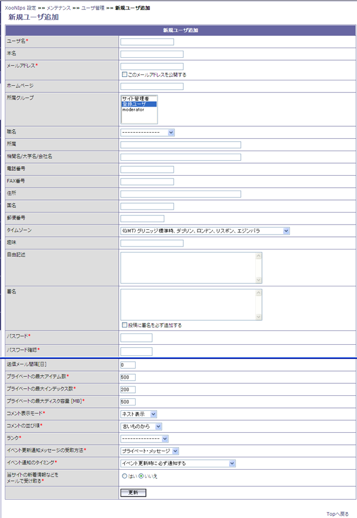

# 2.2. ユーザー管理

 ユーザー情報の編集と削除、新規ユーザーの追加登録が出来ます。

**Figure 4.17.**  **ユーザ管理**

操作欄のペンアイコンをクリックするとユーザ情報の編集が出来ます。

操作欄のXアイコンをクリックするとユーザの削除が出来ます。

## 2.2.1. **新規ユーザーの登録・既存ユーザー情報の編集** 

ユーザー情報の編集をします。＊は必須入力項目です。更新が終わったら画面最下部の更新ボタンを押して情報を反映させます。

パスワードの変更はここで変更が可能です。

必須項目の数はサイトポリシーのユーザ情報で設定した項目により増減します。

* ユーザ名

  XooNIpsサイト上で表示されるユーザーのニックネームを入力します。

* 本名

  ユーザーの本名を入力します。

* メールアドレス

  Eメールアドレスを入力します。ユーザー情報としてメールアドレスを公開する場合にはチェックボックスにチェックを付けます。

* ホームページ

  ユーザーが公開したいURLを入力します。

* 所属グループ

  ユーザーが所属するXOOPSグループを選択します。

  **Table 4.8. 所属グループ**

  <table>
    <thead>
      <tr>
        <th style="text-align:left">&#x540D;&#x79F0;</th>
        <th style="text-align:left">&#x8AAC;&#x660E;</th>
      </tr>
    </thead>
    <tbody>
      <tr>
        <td style="text-align:left">&#x30B5;&#x30A4;&#x30C8;&#x7BA1;&#x7406;&#x8005;</td>
        <td style="text-align:left">XOOPS&#x3067;&#x6307;&#x5B9A;&#x3055;&#x308C;&#x3066;&#x3044;&#x308B;Webmasters&#x30B0;&#x30EB;&#x30FC;&#x30D7;&#x306B;&#x6240;&#x5C5E;&#x3055;&#x305B;&#x307E;&#x3059;</td>
      </tr>
      <tr>
        <td style="text-align:left">&#x767B;&#x9332;&#x30E6;&#x30FC;&#x30B6;</td>
        <td style="text-align:left">
          
XOOPS&#x3067;&#x6307;&#x5B9A;&#x3055;&#x308C;&#x3066;&#x3044;&#x308B;Registered
            Users&#x30B0;&#x30EB;&#x30FC;&#x30D7;&#x306B;&#x6240;&#x5C5E;&#x3055;&#x305B;&#x307E;&#x3059;&#x3002;

          
&#x4E00;&#x822C;&#x767B;&#x9332;&#x30E6;&#x30FC;&#x30B6;&#x30FC;&#x306E;&#x5834;&#x5408;&#x306B;&#x306F;&#x3053;&#x306E;&#x30B0;&#x30EB;&#x30FC;&#x30D7;&#x306E;&#x307F;&#x306B;&#x6240;&#x5C5E;&#x3055;&#x305B;&#x307E;&#x3059;&#x3002;

        </td>
      </tr>
      <tr>
        <td style="text-align:left">moderator</td>
        <td style="text-align:left">
          
XooNIps&#x306E;moderator&#x30B0;&#x30EB;&#x30FC;&#x30D7;&#x306B;&#x6240;&#x5C5E;&#x3055;&#x305B;&#x307E;&#x3059;&#x3002;

          
&#x65B0;&#x898F;&#x767B;&#x9332;&#x30E6;&#x30FC;&#x30B6;&#x30FC;&#x304C;&#x30E2;&#x30C7;&#x30EC;&#x30FC;&#x30BF;&#x30FC;&#x306E;&#x5834;&#x5408;&#x306B;&#x306F;&#x3053;&#x306E;&#x30B0;&#x30EB;&#x30FC;&#x30D7;&#x306B;&#x6240;&#x5C5E;&#x3055;&#x305B;&#x307E;&#x3059;&#x3002;

        </td>
      </tr>
    </tbody>
  </table>

* 職名

  ユーザーの役職名をドロップダウンリストから選択します。

* 所属

  ユーザーの所属部署などを入力します。

* 機関名／大学名／会社名

  ユーザーの所属する機関名・大学名・会社名などを入力します。

* 電話番号

  ユーザーが公開したい電話番号を入力します。

* FAX 番号

  ユーザーが公開したいFAX番号を入力します。

* 住所

  ユーザーが公開したい住所を入力します。

* 国名

  ユーザーの国名を入力します。

* 郵便番号

  ユーザーが公開したい郵便番号を入力します。

* タイムゾーン

  ユーザーの国に合わせたタイムゾーンを選択します。

* 趣味

  ユーザーの公開したい趣味などを入力します。

* 自由記述

  自由記述項目です。

* 署名

  署名を入力します。投稿に署名を必ず追加する場合はチェックボックスにチェックを付けます。

* パスワード

  パスワードを登録します。

* パスワード確認

  上と同じパスワードをもう一度入力してもらうことで、パスワードの確認を行います。

* 送信メール間隔\[日\]

  イベント更新通知メッセージの受け取り方法で新しいアイテムの登録時にメールで情報を受け取る様に設定した場合、メールが送られる間隔を日数で指定します。

  イベント更新通知メッセージの受け取り方法をメールに指定した場合に有効な設定です。

* プライベートの最大アイテム数

  Private領域の最大アイテム数を入力します。

  デフォルト値は５００でPrivate領域に５００アイテムまで登録できます。

* プライベートの最大インデックス数

  Private領域の最大インデックス数を入力します。

  デフォルト値は２００でPrivateIndexに２００個までキーワードを登録できます。

* プライベートの最大ディスク容量 \[MB\]

  Private領域の最大ディスク容量をMB単位で入力します。

  デフォルト値は５００でPrivate領域のディスク使用量は５００MBになります。

* コメント表示モード

  コメントの表示モードを指定します。

  XooNIps3.4のアイテムへのコメント機能の設定ではありません。XOOPS標準のコメント機能についての設定です。

  **Table 4.9. コメント表示モード**

  <table>
    <thead>
      <tr>
        <th style="text-align:left">&#x8868;&#x793A;&#x30E2;&#x30FC;&#x30C9;</th>
        <th style="text-align:left">&#x8AAC;&#x660E;</th>
      </tr>
    </thead>
    <tbody>
      <tr>
        <td style="text-align:left">&#x30CD;&#x30B9;&#x30C8;&#x8868;&#x793A;</td>
        <td style="text-align:left">
          
&#x30B3;&#x30E1;&#x30F3;&#x30C8;&#x304C;&#x30CD;&#x30B9;&#x30C8;&#x8868;&#x793A;&#x3055;&#x308C;&#x307E;&#x3059;&#x3002;

          
&#x30C4;&#x30EA;&#x30FC;&#x306B;&#x5F93;&#x3063;&#x3066;&#x30B3;&#x30E1;&#x30F3;&#x30C8;&#x306E;&#x90E8;&#x5206;&#x306F;&#x30A4;&#x30F3;&#x30C7;&#x30F3;&#x30C8;&#x3055;&#x308C;&#x307E;&#x3059;&#x3002;

        </td>
      </tr>
      <tr>
        <td style="text-align:left">&#x30D5;&#x30E9;&#x30C3;&#x30C8;&#x8868;&#x793A;</td>
        <td style="text-align:left">
          
&#x30B3;&#x30E1;&#x30F3;&#x30C8;&#x304C;&#x30D5;&#x30E9;&#x30C3;&#x30C8;&#x8868;&#x793A;&#x306B;&#x306A;&#x308A;&#x307E;&#x3059;&#x3002;

          
&#x5168;&#x3066;&#x306E;&#x30B3;&#x30E1;&#x30F3;&#x30C8;&#x304C;&#x6295;&#x7A3F;&#x6642;&#x9593;&#x9806;&#x306B;&#x5168;&#x6587;&#x8868;&#x793A;&#x3055;&#x308C;&#x307E;&#x3059;&#x3002;

        </td>
      </tr>
      <tr>
        <td style="text-align:left">&#x30B9;&#x30EC;&#x30C3;&#x30C9;&#x8868;&#x793A;</td>
        <td style="text-align:left">
          
&#x30B3;&#x30E1;&#x30F3;&#x30C8;&#x304C;&#x4EF6;&#x540D;&#x306B;&#x3088;&#x3063;&#x3066;&#x30B0;&#x30EB;&#x30FC;&#x30D7;&#x5316;&#x3057;&#x3066;&#x8868;&#x793A;&#x3055;&#x308C;&#x307E;&#x3059;&#xFF08;&#x30B9;&#x30EC;&#x30C3;&#x30C9;&#x8868;&#x793A;&#xFF09;

          
&#x30B9;&#x30EC;&#x30C3;&#x30C9;&#x306E;&#x6700;&#x521D;&#x306E;&#x6295;&#x7A3F;&#x306E;&#x307F;&#x5168;&#x6587;&#x8868;&#x793A;&#x3055;&#x308C;&#x3001;&#x30B3;&#x30E1;&#x30F3;&#x30C8;&#x306F;&#x30BF;&#x30A4;&#x30C8;&#x30EB;&#x3060;&#x3051;&#x305D;&#x306E;&#x4E0B;&#x306B;&#x4E26;&#x3073;&#x307E;&#x3059;&#x3002;

        </td>
      </tr>
    </tbody>
  </table>

* コメントの並び順

  コメントの並び順を指定します。

  **Table 4.10. コメントの並び順**

  | 並び順 | 説明 |
  | :--- | :--- |
  | 古いものから | コメントが古い順に表示されます。 |
  | 新しいものから | コメントが新しい順に表示されます。 |

* ランク

  ランクを指定します。

  未選択の状態で問題ありません。

* イベント更新通知メッセージの受け取り方法

  イベント通知メッセージの受け取り方法を指定します。

  **Table 4.11. メッセージ受け取り**

  | メッセージ受け取り方法 | 説明 |
  | :--- | :--- |
  | 一時的に中止 | イベント通知のメッセージ受け取りを一時的に停止させます。 |
  | プライベートメッセージ | イベント通知のメッセージをXOOPSのPM機能で受け取ります。 |
  | メール | イベント通知のメッセージをユーザー情報のEメールアドレスで受信します。 |

* イベント通知のタイミング

  イベント通知メッセージの通知タイミングを指定します。

  **Table 4.12. 通知タイミング**

  | 通知タイミング | 説明 |
  | :--- | :--- |
  | イベント更新時に必ず通知する | イベント発生時に必ず通知する設定です。 |
  | 一度だけ通知する | 一度だけ通知する。 |
  | 一度通知した後、再度ログインするまで通知しない | 一度通知した後、再度ログインするまで通知しない。 |

* 当サイトの新着情報などをメールで受け取る

  当XooNIpsサイトの新着情報等をメールで受け取るか否かを指定します。

**Figure 4.18.**  **ユーザ登録**

 入力された情報はホームページのXooNIps User Menuのユーザ情報から確認出来ます。

