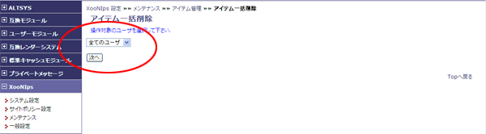
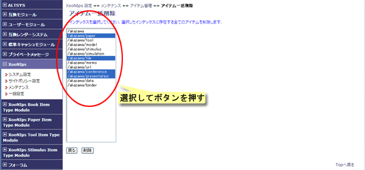
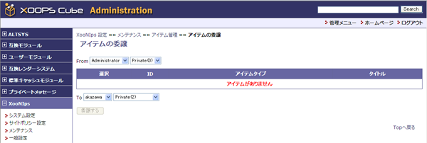
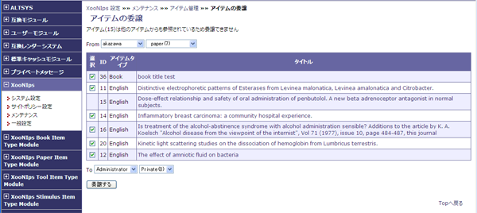
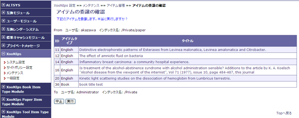

# 2.3. アイテム管理\)

公開アイテムの一括取り下げ、ユーザー毎のアイテムの一括削除、アイテムの移譲が出来ます。

* 公開アイテム一括取り下げ

  公開アイテムの一括取り下げを行います。

* アイテム一括削除

  アイテム一括削除を行います。

* アイテムの移譲

  退会したユーザのアイテムを別のユーザに移譲します。

## 2.3.1. **公開アイテム一括取り下げ** 

Publicに登録されているアイテムをインデックス毎に選択して削除することが出来ます。

#### Tip

Public indexへの公開が取り下げられるのみでアイテムが削除されることはありません。

## **2.3.2. アイテム一括削除**

ユーザーのアイテムをインデックス毎に削除することができます。

ドロップダウンリストからユーザーを選択します

**Figure 4.20. アイテム一括削除**  

一括削除したいインデックスを選択して、削除ボタンを押すと削除が実行されます。

**Figure 4.21. アイテム一括削除2**  

## **2.3.3. アイテムの移譲**

XooNIpsでは登録したアイテムの修正や変更は登録したユーザのみが行えます。

ユーザがサイトを退会した場合などに登録アイテムの修正や変更が行えるように権限を移譲することが出来ます。

ドロップダウンリストで権限を移譲する側\(From\)とされる側\(To\)のユーザとIndex Keywordを選択します。

**Figure 4.22. アイテムの移譲**  

移譲するアイテムの欄にチェックをつけて移譲するボタンを押すと確認画面が表示されます。

**Figure 4.23. アイテムの移譲2**  

確認画面で実行ボタンを押すと権限が移譲されます。

 **Figure 4.24. アイテムの移譲3**

