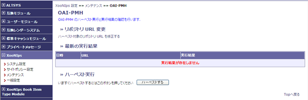

# 2.7. OAI-PMH

OAI-PMHのハーベスト実行と結果の確認が出来ます。

#### Tip

メタデータのハーベストが必要の都度手動で実行する必要があります。

* リポジトリURL変更

  リポジトリURLの設定画面に遷移して、編集が出来ます。

* 最新の実行結果

  前回の実行結果を表示します。

* ハーベスト実行

  ハーベストするボタンを押すと、直ちにハーベストを実行します。

 **Figure 4.29. OAI-PMH**

