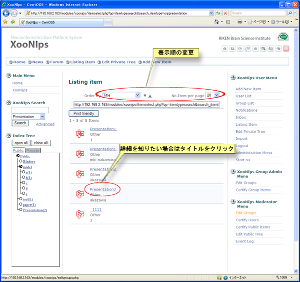

# 1.1. 公開情報の検索・閲覧

ゲスト時はPublicに登録されているアイテムの検索と閲覧が出来ます

インデックスツリー・アイテムタイプをクリックすることで一覧表示されます。

キーワード検索ボックスではアイテムタイプを指定しての検索や、メタデータの検索も選択することが出来ます。

**Figure 5.1.**  **ファイル検索**

 並び順の項目で並べ替えが出来ます。アイテムタイプによって並べ替えの条件は異なる場合があります。

**Figure 5.2.**  **検索結果**

 詳細画面では登録者がゲストユーザーにもダウンロードを許可している場合のみダウンロードボタンが表示されます。

**Figure 5.3.**  **詳細結果**

 ライセンス条項に同意する場合のみダウンロードすることが可能です。

**Figure 5.4.**  **ライセンス条項確認**

