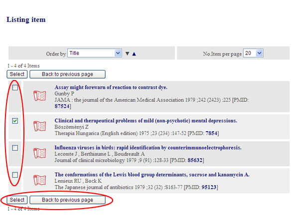
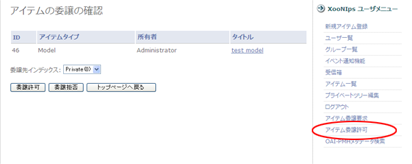

# 2.7. アイテム移譲

アイテムの編集権限はそのアイテムを登録したユーザにあります。

ユーザが退会する場合などにアイテムの編集権限を他のユーザに移譲することができます。

* 編集権限を移譲するユーザの操作

  XooNIpsユーザメニューのアイテム移譲要求のリンクをクリックします。

**Figure 5.53.**  **アイテム移譲要求**  
  

 「次からアイテムを追加」の欄にある「検索」ボタンなどで編集権限を移譲するアイテムを検索して選択します。

**Figure 5.54.**  **アイテム移譲要求2**

 ドロップダウンリストで権限を移譲するユーザを選択して「次へ」ボタンを押します。

**Figure 5.55.**  **アイテム移譲要求3**

 確認画面が表示されるので「移譲の実行」ボタンを押します。

**Figure 5.56.**  **アイテム移譲要求4**

* 編集権限を移譲されるユーザの操作

  XooNIpsユーザメニューのアイテム移譲許可リンクをクリックします。

  ドロップダウンリストから編集権限を移譲されたアイテムを登録するIndex Tree Keywordを選択して「移譲許可」ボタンを押します。

**Figure 5.57.**  **アイテム移譲許可**

