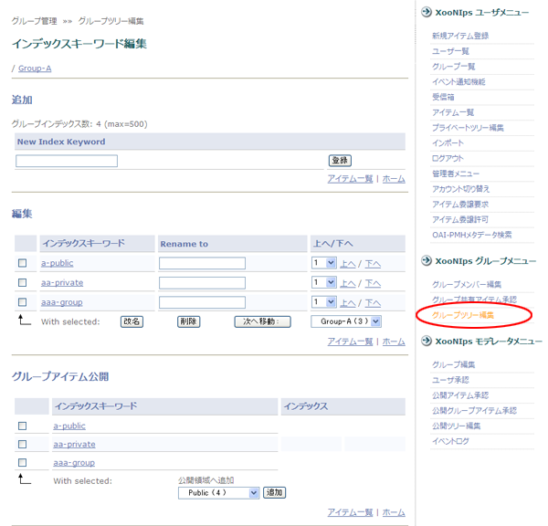

# 3.5. グループIndexの公開

グループIndexに登録してあるアイテムをKeyword単位で一括してPublicIndexに登録することが出来ます。

* グループ管理者

  XooNIpsグループメニューのグループツリー編集メニューをクリックします。

**Figure 5.67. Block publishing of group indexes**

At the "Publication group item" check the checkboxes of the keywords to be published.

By the dropdown list, choose a public index keyword to which the checked index keywords are to be added. Click on the \[Submit\] button.

  
グループアイテム公開の欄で公開するKeywordにチェックをつけます。

PublicIndexの追加したいKeywordをドロップダウンリストから選択して「追加」ボタンを押します。

**Figure 5.68. グループIndexの一括公開2**

モデレータ

XooNIpsモデレータメニューの公開グループアイテム承認リンクをクリックします。

**Figure 5.69. グループIndexの一括公開3**  

公開を承認または拒否するインデックスにチェックを付けます。

「Accept\(承認」）または「Reject（拒否）」ボタンをおして公開を承認または拒否します。

