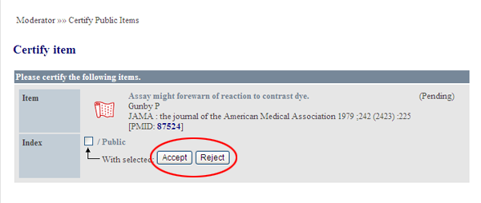

# 4.3. アイテムの審査・承認

Public領域にアイテムを公開するかどうか、審査・承認が出来ます。

XooNIps モデレータメニューの公開アイテム承認のリンクをクリックします。.

**Figure 5.73.**  **アイテムの審査・承認**

 「Accept\(承認\)」「Reject\(取り下げ）」のボタンを押すことで実行可能です。

**Figure 5.74.**  **アイテムの審査・承認2**

