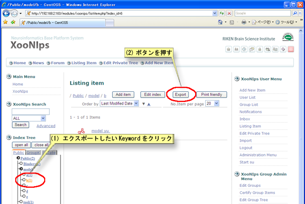
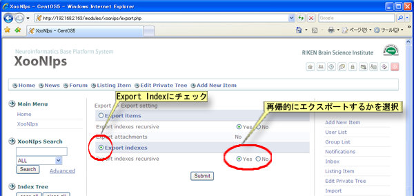
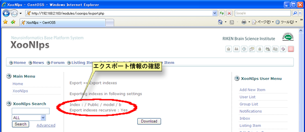
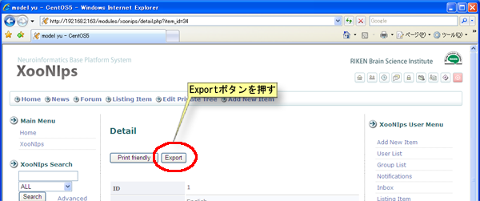
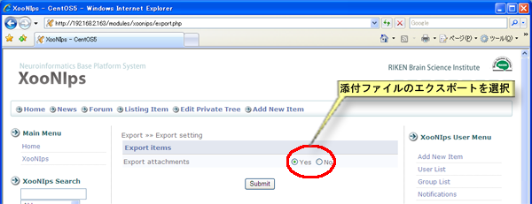
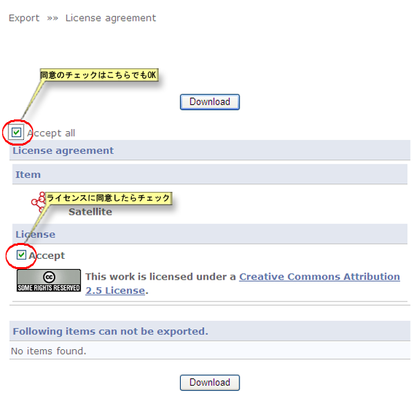

# 5.3. エクスポート

他のXooNIpsサイトへアイテムやIndexTree構造を利用出来るようにする為のファイル書き出し機能です。

#### Tip

サイトポリシー設定のImport/Exportの項目でenabledの項目がYesに設定されている場合は登録ユーザーでもインポート・エクスポートが可能になります。

エクスポートされる内容

* アイテム

  同一のIndex keywordに登録されている複数のアイテムを同時にエクスポートすることも出来ます。

  **Tip**

  添付ファイルをエクスポートするかどうかはサイトポリシー設定のImport/Exportでの設定で決定されます。

* Index Tree keyword

  Indexの構造をエクスポート出来ます。

エクスポートの手順

1. Index Tree keywordのエクスポート方法

   **Tip**

   アイテムが登録されていない空のIndex Keywordはエクスポート出来ません。

   Index Keywordをクリックしてアイテム一覧画面を表示します。

   エクスポートしたいKeywordをクリックして、「Export」ボタンを押します。

**Figure 5.85. Indexのエクスポート**  

インデックスツリーをエクスポートするにチェックを入れます。再帰的にエクスポートする場合にはインデックスを再帰的にエクスポートするの項目をはいに設定してください。

**Figure 5.86. Indexのエクスポート2**  

エクスポートされる情報が表示されますので、確認した上で「ダウンロード」ボタンを押すとエクスポートファイルがダウンロードされます。

**Figure 5.87. Indexのエクスポート3**  

1. アイテムのエクスポート

   検索などを利用してエクスポートしたいアイテムの詳細画面を表示して、「エクスポート」ボタンを押します。

**Figure 5.88. アイテムのエクスポート**  

添付ファイルを同時にエクスポートするかどうかの設定をします。

**Tip**

サイトポリシー設定のインポート/エクスポート設定で添付ファイルのエクスポートの項目がいいえの場合にはここで選択項目は現れません。

**Figure 5.89. アイテムのエクスポート2**  

アイテムダウンロードのライセンス条項に同意して、合意するにチェックを付け「ダウンロード」ボタンを押すとエクスポートファイルがダウンロードされます。

**Figure 5.90. アイテムのエクスポート3**

