### 2.3. プライベートインデックスツリー編集 {#2-3}

アイテムを管理する個人領域のインデックスツリーの編集が出来ます。

XooNIps User Menuのプライベートツリー編集のリンクをクリックします。

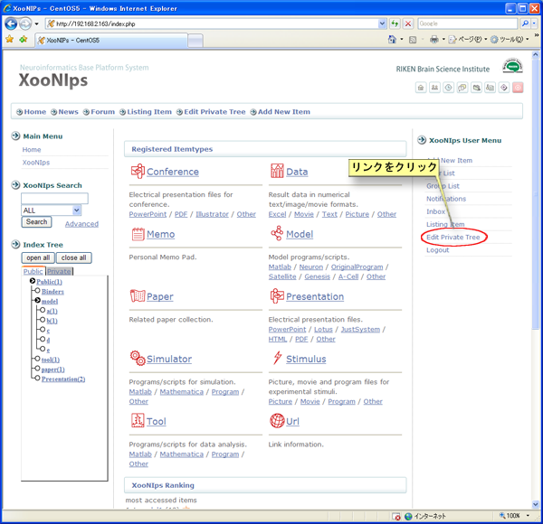

**Figure 5.13. プライベートツリー編集**

1.  Keywordの新規登録

    New Index Keywordに作成したいKeywordを入力して「登録」ボタンを押します。

    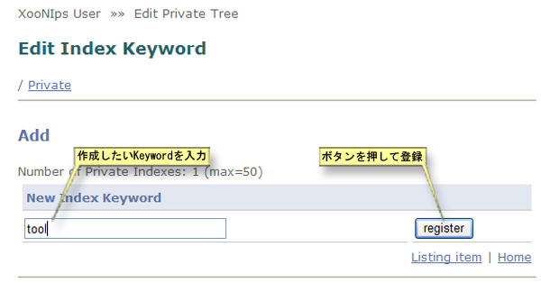

    **Figure 5.14. プライベートツリー編集**

    Privateツリーの直下に登録されます。

    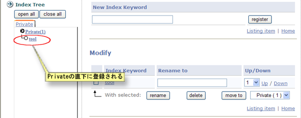

    **Figure 5.15. プライベートインデックスへのKeyword新規登録**

2.  Keywordの変更

    登録したKeywordは修正することが出来ます。

    操作したいKeywordのチェックを入れた後、新しいKeywordを入力して「改名」ボタンを押します。

    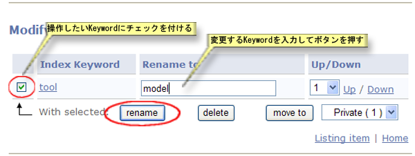

    **Figure 5.16. Keywordの変更**

    keyword[tool]が[model]に変更されています。

    

    **Figure 5.17. Keyword変更後のIndex**

3.  Keywordの削除

    削除したいKeywordにチェックを入れた後、「削除」ボタンを押します。

    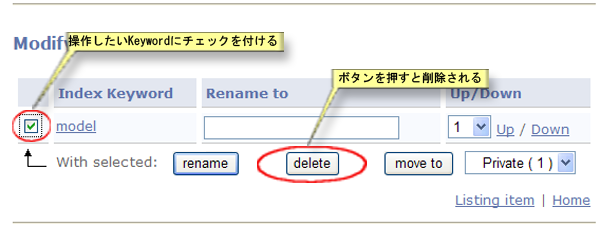

    **Figure 5.18. Keywordの削除**

    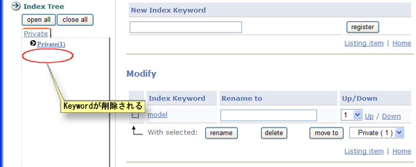

    **Figure 5.19. Keywordの削除後のIndex**

4.  Keywordの表示順の変更

    Keywordの表示順の変更が出来ます。

    上へ/下への左にあるドロップダウンリストで1～10までの数を指定しての移動も可能です。

    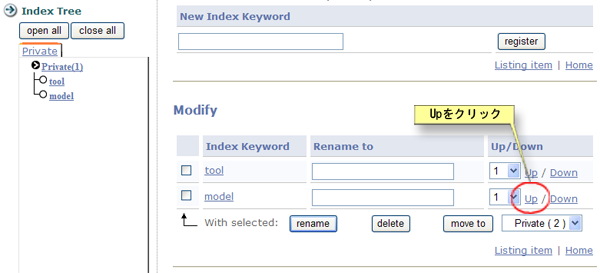

    **Figure 5.20. Keywordの表示順変更**

    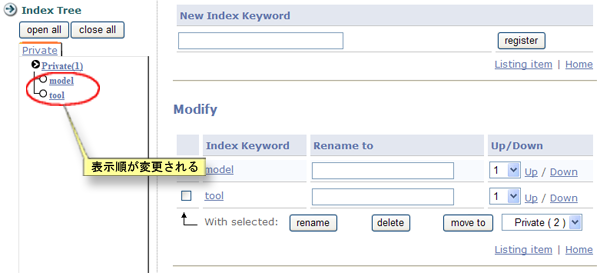

    **Figure 5.21. Keyword表示順変更後のIndex**

5.  Keywordの移動

    Keywordの移動が出来ます。

    「次へ移動」ボタンの右にあるドロップダウンリストで移動先を選択した後、ボタンを押します。

    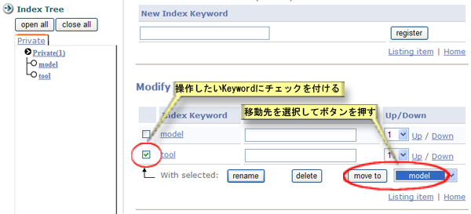

    **Figure 5.22. Keywordの移動**

    移動の確認はIndex Treeの上にある「open all」ボタンを押します。

    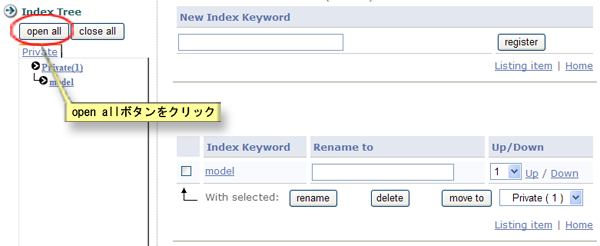

    **Figure 5.23. Keyword移動の確認**

    Keyword[tool]が[model]の下に移動している事が確認出来ます。

    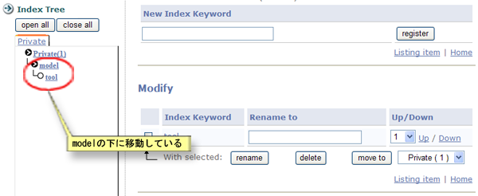

    **Figure 5.24. Keyword移動後のIndex**