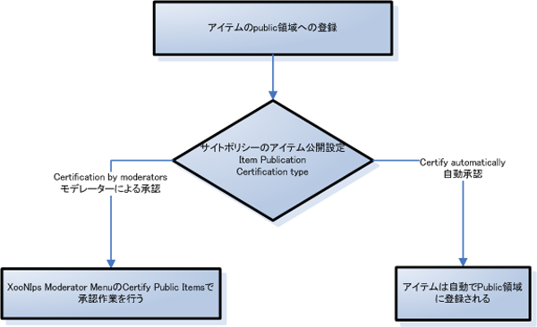
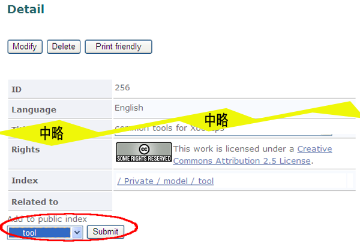
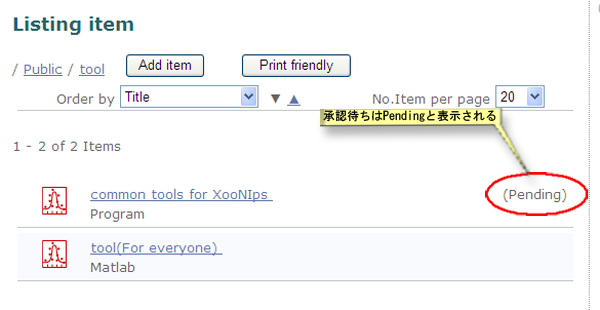

### 2.5. アイテムの公開 {#2-5}

アイテムをPublic領域に登録するためにはサイトポリシーの設定によってモデレーターの審査・承認が必要な場合があります。

**Figure 5.44. アイテム公開フロー**

#### 2.5.1. アイテムの公開 {#2-5-1}

Public領域に登録して公開したいアイテムをIndex TreeやXooNIps検索で検索して、詳細画面を表示します。

公開領域に追加の欄あるドロップダウンリストから登録したいPublic領域のIndex keywordを選択して、「追加」ボタンを押します。

**Figure 5.45. 公開アイテム登録画面**

サイトポリシーの設定によってはモデレーターの審査・承認が必要ですので、Public領域に直ぐに登録されるとは限りません。

**Figure 5.46. 公開アイテム確認画面**