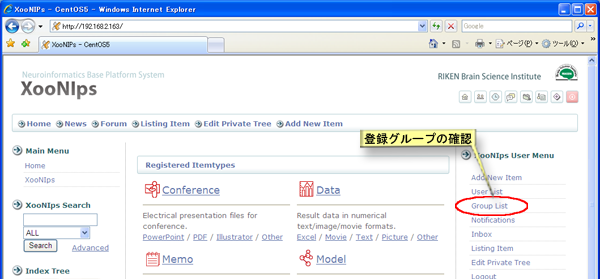
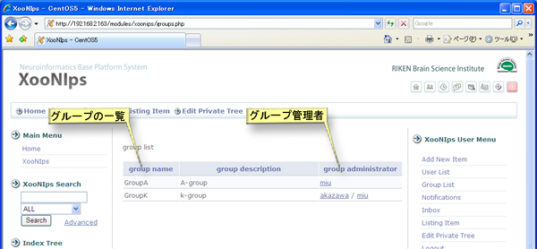
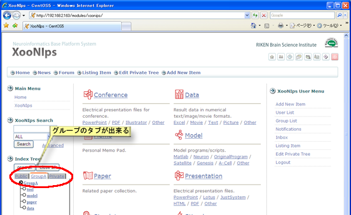
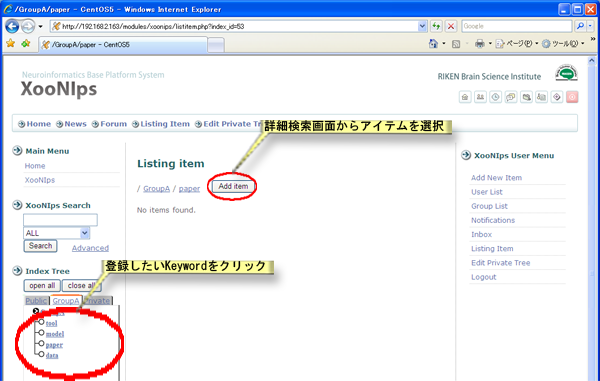
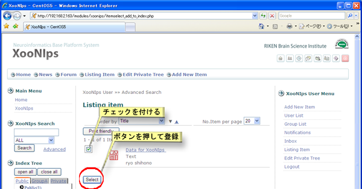
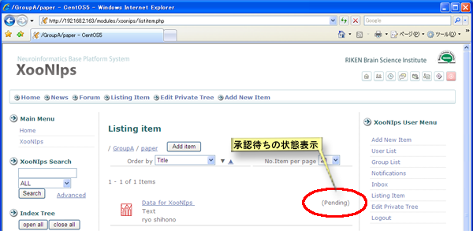

### 2.6. グループ {#2-6}

XooNIpsでは登録ユーザーでグループを作ることが出来ます。

グループにはグループ内で情報を共有できる領域が与えられます。

#### 2.6.1. グループに参加 {#2-6-1}

XooNIpsに登録されているグループを検索します。

グループ管理者となっているユーザーにグループに追加してもらうよう、メールやPM(Private Message)で連絡を取ります。

グループへのユーザー追加登録作業は、グループ管理者またはモデレーターが行います。

**Figure 5.47. 登録グループの確認**

**Figure 5.48. 登録グループの確認2**

グループに参加すると、所属グループのタブがIndex Treeに表示されます。

**Figure 5.49. 所属グループのタブ**

#### 2.6.2. グループIndexへのアイテム登録 {#2-6-2-index}

ユーザーがPrivate領域に登録しているアイテムをグループIndexに登録することが出来ます。

登録したいグループのタブでIndex Keywordをクリックします。

アイテム検索画面が表示されますので、登録するアイテムを検索してください。

**Figure 5.50. グループIndexへの登録**

グループIndexへ登録するアイテムにチェックを付けます。

**Figure 5.51. グループIndexへの登録2**

グループ管理者、またはモデレーターの審査・承認が完了するまで他のユーザーからはアイテムは見ることが出来ません。

**Figure 5.52. グループIndexへの登録3**

#### 2.6.3. グループからの退会 {#2-6-3}

グループから退会する場合は参加の場合と同様に、グループ管理者かモデレーターに連絡を取ってください。

ユーザーのグループからの退会処理はグループ管理者、またはモデレーターが行います。