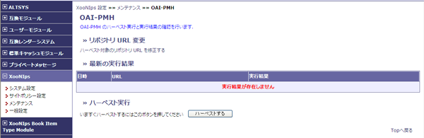

### Tip {#tip}

メタデータのハーベストが必要の都度手動で実行する必要があります。

*   リポジトリURL変更

    リポジトリURLの設定画面に遷移して、編集が出来ます。

*   最新の実行結果

    前回の実行結果を表示します。

*   ハーベスト実行

    ハーベストするボタンを押すと、直ちにハーベストを実行します。

**Figure 4.29. OAI-PMH**

|   |   |   |
| --- | --- | --- |
|   |   |   |

Last updated: 2011/07/12