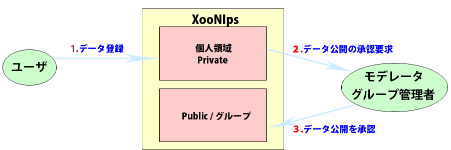

### 2.3. サイト品質管理のワークフロー {#2-3}

#### 2.3.1. 登録ユーザの管理 {#2-3-1}

新しくユーザを登録するときはモデレータが登録の内容を確認してから実際にユーザを登録するという方法が選択出来ます。（設定画面で変更できます）

この機能により悪意のあるユーザの登録を防ぐことができます。

**Figure 1.4. ユーザ管理システム**

#### 2.3.2. アイテムの管理 {#2-3-2}

アイテムをPublicやGroupに登録して公開可能にする前段階にモデレータやグループ管理者による査読を行うことが出来ます。（設定画面で変更できます）

WEBサイトに公開される情報の品質管理機能として利用できます。

**Figure 1.5. 査読システム**