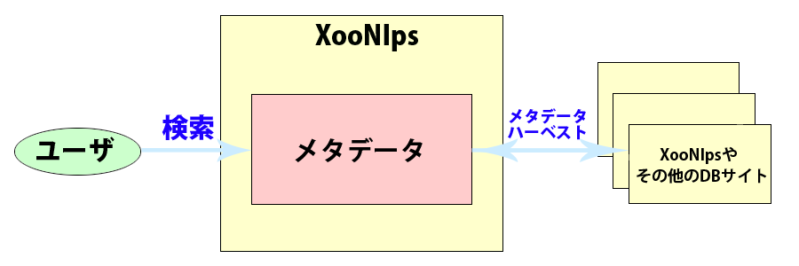

### 2.4. メタデータ {#2-4}

#### 2.4.1. メタデータを利用した他のデータベースサイトからの検索が可能 {#2-4-1}

*   OAI-PMHに対応したデータベースサイトと連携が可能

    *   リポジトリ、ハーベスタどちらにもなることができます。

    *   メタデータ のフォーマット

        *   以下のフォーマットに対応：OAI-DC, JUNII, JUNII2

**Figure 1.6. メタデータを利用した他DBからの検索**