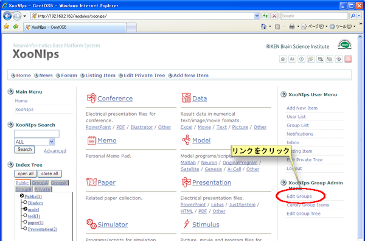
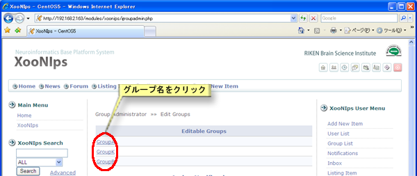
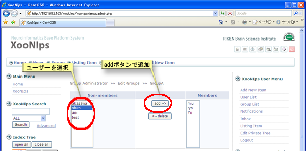
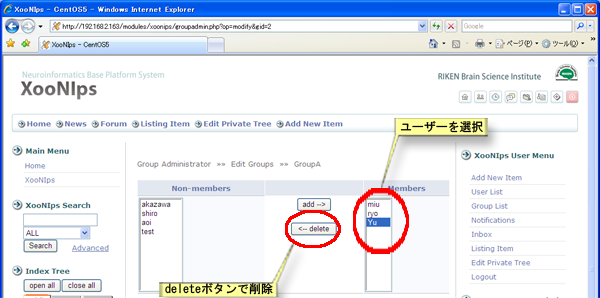

### 3.1. グループメンバー管理 {#3-1}

XooNIps グループメニューのグループメンバー編集をクリックします。

サイトのデザインによってはこの位置にあるとは限りません。

**Figure 5.58. グループメンバーの追加・削除**

複数のグループ管理者の権限を持っている場合は更にメンバーの追加・削除を行うグループ名をクリックします。

**Figure 5.59. グループメンバーの追加・削除2**

#### 3.1.1. メンバーの追加 {#3-1-1}

非メンバーのリストからユーザーを選択して、「追加」ボタンを押してメンバーに追加します。

**Figure 5.60. グループメンバーの追加**

#### 3.1.2. メンバーの削除 {#3-1-2}

メンバーのリストからユーザーを選択して、「削除」ボタンを押してメンバーから削除します。

**Figure 5.61. グループメンバーの削除**