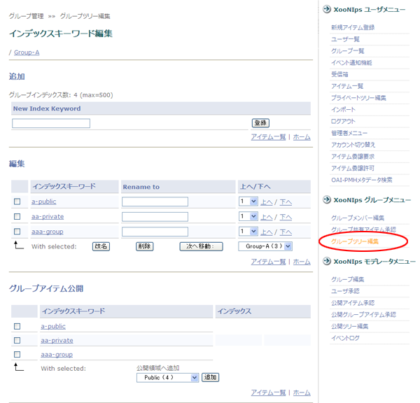
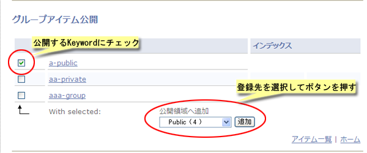
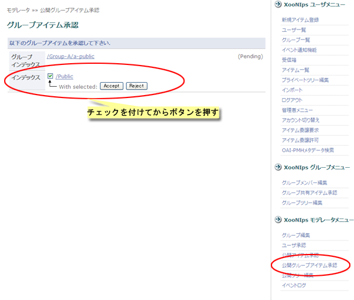

### 3.5. グループIndexの公開 {#3-5-index}

グループIndexに登録してあるアイテムをKeyword単位で一括してPublicIndexに登録することが出来ます。

*   グループ管理者

    XooNIpsグループメニューのグループツリー編集メニューをクリックします。

    

    **Figure 5.67. グループIndexの一括公開**

    グループアイテム公開の欄で公開するKeywordにチェックをつけます。

    PublicIndexの追加したいKeywordをドロップダウンリストから選択して「追加」ボタンを押します。

    

    **Figure 5.68. グループIndexの一括公開2**

*   モデレータ

    XooNIpsモデレータメニューの公開グループアイテム承認リンクをクリックします。

    

    **Figure 5.69. グループIndexの一括公開3**

    公開を承認または拒否するインデックスにチェックを付けます。

    「Accept(承認」）または「Reject（拒否）」ボタンをおして公開を承認または拒否します。