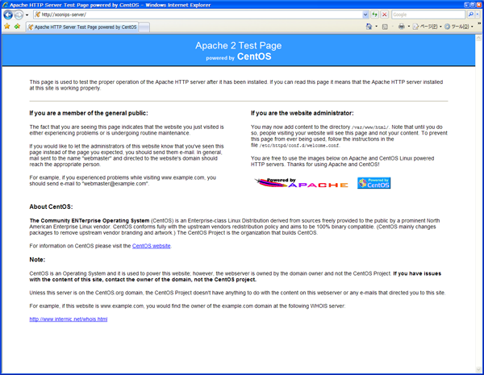

### 4.7. Apacheの設定 {#4-7-apache}

Webサーバ(Apache)の設定をします。

#### 4.7.1. 設定ファイルの編集 {#4-7-1}

| `[root@xoonips-server ~]#` **vi /etc/httpd/conf/httpd.conf** | ← 設定ファイルの編集 |
| --- | --- |
| **AddDefaultCharset UTF-8** |
| ↓ |
| **#AddDefaultCharset UTF-8** | ← コメントにする |

#### 4.7.2. Webサーバの起動と自動起動設定 {#4-7-2-web}

コンピュータを再起動したときにWebサーバも自動で起動するように設定します。

| `[root@xoonips-server ~]#` **/etc/init.d/httpd start** | ← Webサーバ起動 |
| --- | --- |
| `[root@xoonips-server ~]#` **chkconfig httpd on** | ← Webサーバの自動起動設定 |

#### 4.7.3. Webサーバの動作確認 {#4-7-3-web}

他のコンピュータでブラウザを起動し、アドレスを入力します。

例えばhttp://(OSインストールの時に決めたホスト名)/と入力します。

以下のような画面がブラウザに表示されていればWebサーバの設定は完了です。

