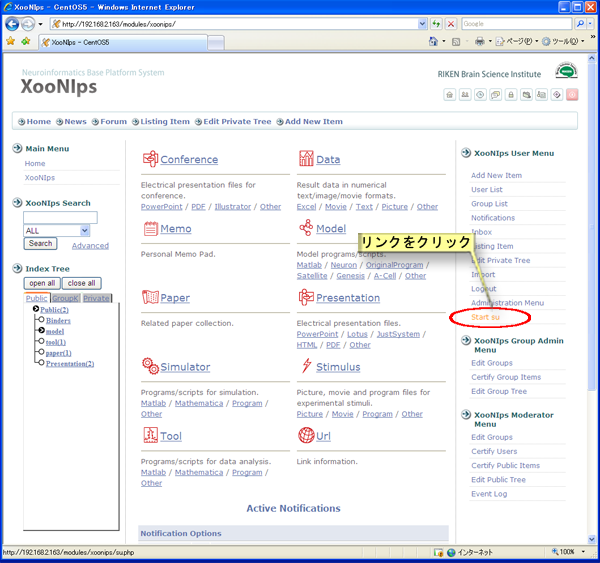
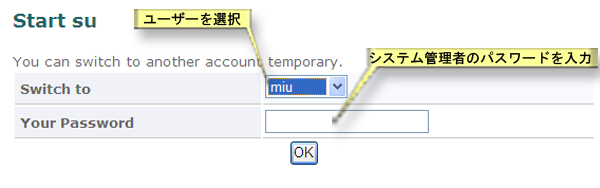
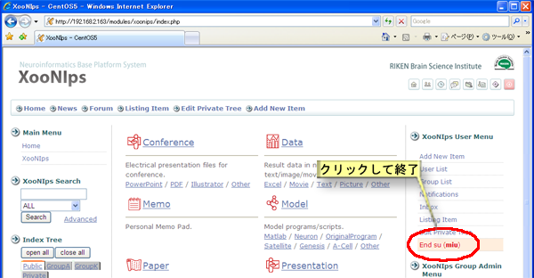

### 5.2. ユーザー切り替え機能 {#5-2}

XooNIpsでは登録したアイテムは登録したユーザーのみがアイテムの変更・修正が可能です。

システム管理者は他ユーザー権限での実行が出来ますので、他ユーザーの登録したアイテムであっても変更・修正が可能となります。

XooNIps ユーザメニューのアカウント切り替えのリンクをクリックします。

**Figure 5.82. ユーザ切り替え機能**

ドロップダウンリストからユーザーを選択してシステム管理者のパスワードを入力します。

**Figure 5.83. ユーザ切り替え機能2**

ユーザーとしての作業を終了したら、XooNIps ユーザメニューのアカウント切り替え(ユーザー名)の終了のリンクをクリックします。

**Figure 5.84. ユーザ切り替え機能3**