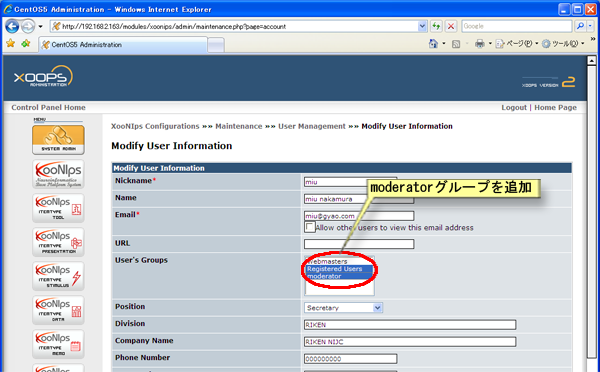

### 5.6. モデレーターの変更 {#5-6}

モデレーターの変更は管理メニューのメンテナンス ユーザ管理 の項目で所属グループにユーザーをモデレーターグループに追加することで変更出来ます。

正確には、システム設定の基本設定モデレータグループで設定したXooNIpsのモデレーターとなっているXOOPSグループを選択して追加します。

**Figure 5.94. モデレーターの変更**

|   |   |   |
| --- | --- | --- |
|   |   |   |

Last updated: 2011/07/12