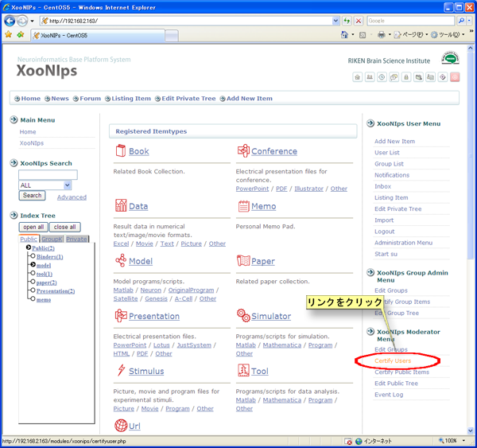
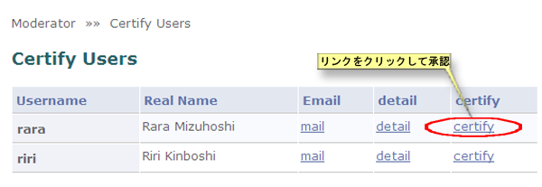

### 4.2. Certify users {#4-2-certify-users}

To entitle non-registered users (new users/guests) to use the XooNIps functions, the moderator may have to perform the following procedure. Refer back to the Table 4.2\. (Chapter 4) &quot;User Registration Policies&quot;. If your site&#039;s site policy has been set as &quot;Certify automatically&quot;, the moderator can skip the following procedure.

Click on the link [Certify Users] at &quot;XooNIps Moderator menu&quot;.

**Figure 5.71. Certify users**

The following functions will be active by clicking on the following links: Email, detail, certify.

*   Email

    A mailer comes out with the email address of the user.

*   Detail

    Show the &quot;Detail&quot; screen of the user&#039;s items.

*   Certify

    Decide whether or not to certify non-registered users. (Users can not use the XooNIps functions without being certified.)

**Figure 5.72. Certify users 2**