### 5.1. XOOPS Cubeセットアップ {#5-1-xoops-cube}

Webブラウザでhttp://サーバ名/へアクセスをします。

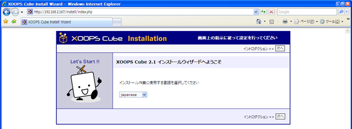

japaneseを選択して[次へ]をクリックします。

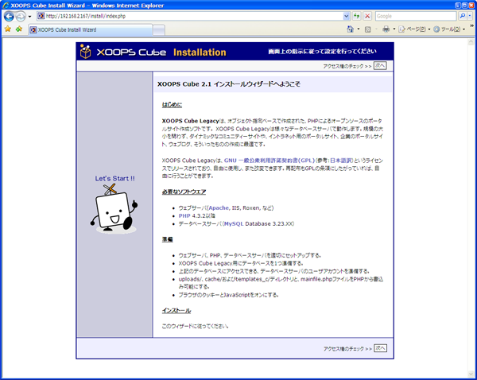

[次へ]をクリックします。

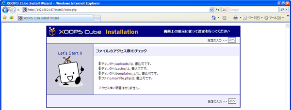

[次へ]をクリックします。

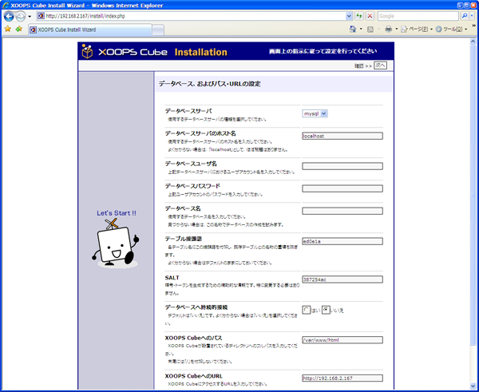

MySQLの設定で作成したデータベースユーザ名・データベースパスワード・データベース名を入力します。

空欄へ以下の情報を入力して[次へ]をクリックします。

| データベースユーザ名 | xoonipsuser |
| --- | --- |
| データベースパスワード | xoonips@pass |
| データベース名 | xoonipsdb |

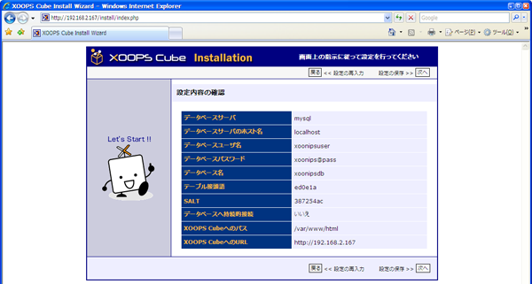

[次へ]をクリックします。

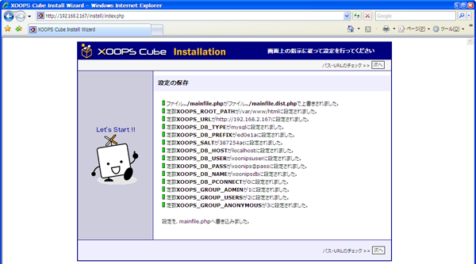

[次へ]をクリックします。

[次へ]をクリックします。

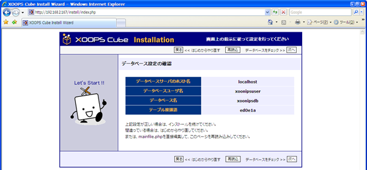

[次へ]をクリックします。

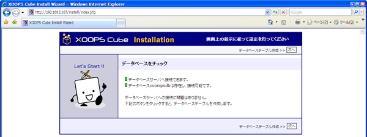

[次へ]をクリックします。

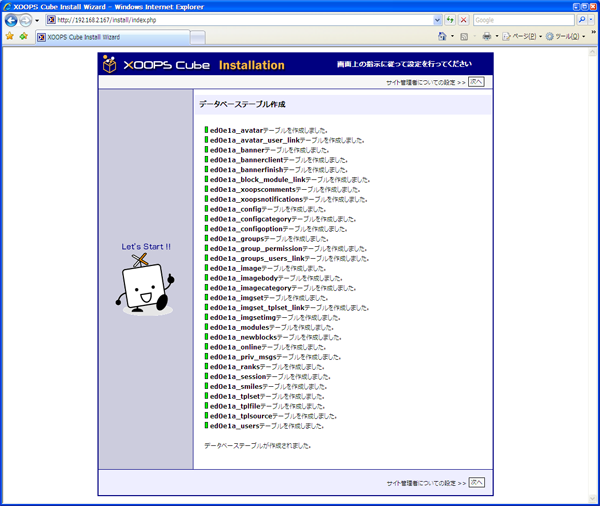

[次へ]をクリックします。

以下の情報を入力して[次へ]をクリックします。

ここで作成するのはXOOPS Cubeを管理するユーザです。

CentOSのユーザやMySQLのユーザとは別のものになります。

| 管理者ユーザ名 | XOOPS Cubeサイト管理者ユーザ名(例はAdministrator) |
| --- | --- |
| 管理者メールアドレス | XOOPS Cubeサイト管理者メールアドレス(例はadmin@xoonips.jp) |
| 管理者パスワード | パスワード |
| 管理者パスワード(再入力) | パスワード |

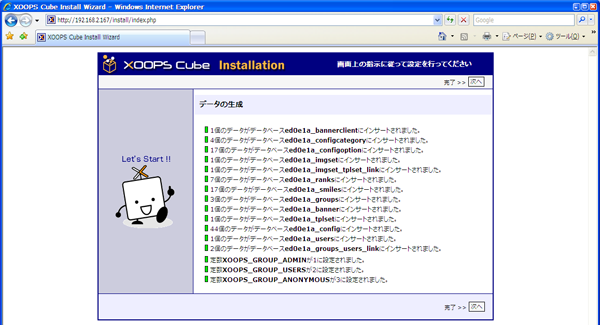

[次へ]をクリックします。

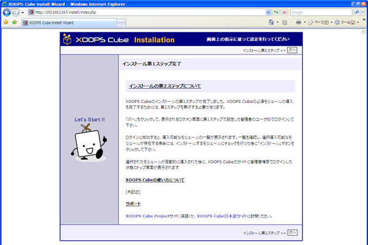

[次へ]をクリックします。

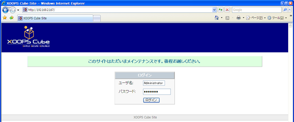

XOOPS Cubeの管理者ユーザ名とパスワードを入力して[ログイン]をクリックします。

インストールボタンをクリックします。

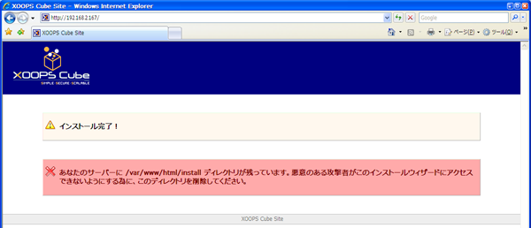

インストール完了です。

Webブラウザを一度終了してください。