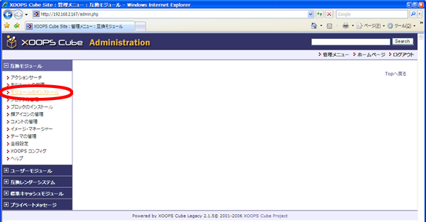
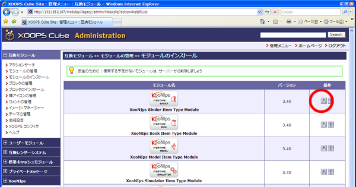

### 6.3. アイテムタイプモジュールのインストール {#6-3}

続いてアイテムタイプモジュールのインストールをします。

| アイテムタイプモジュールをmoduleディレクトリにコピー |
| --- |
| `[root@xoonips-server ~]#` **cp -R xoonips-3.44/itemtypes/* /var/www/html/modules/** |

#### 6.3.1. アイテムタイプモジュールのセットアップ {#6-3-1}

XooNIpsモジュールと同様の手順です。

セットアップするアイテムタイプモジュールの種類はWebサイトの計画と設計により変化します。

[モジュールのインストール]をクリックします。

XooNIpsのインストールと同様にインストールアイコンをクリックしてインストールします。

#### 6.3.2. XooNIpsインストール後の後始末 {#6-3-2-xoonips}

| `[root@xoonips-server ~]#` **rm -f xoonips-3.44.tar.gz** | ← ダウンロードファイル削除 |
| --- | --- |
| `[root@xoonips-server ~]#` **rm -rf xoonips-3.44** | ← 展開ディレクトリ削除 |