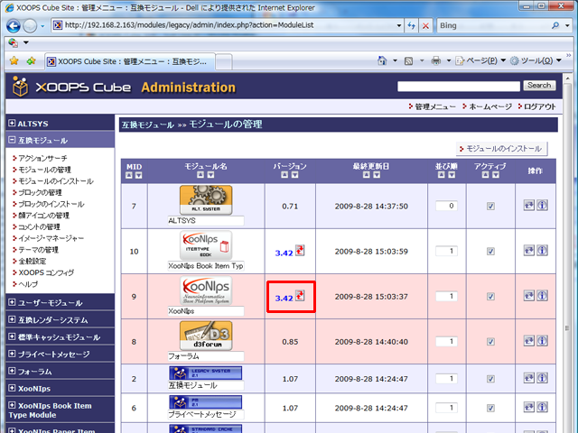

### 6.4. XooNIpsモジュールのアップデート {#6-4-xoonips}

新しいバージョンのXooNIpsが公開された場合にはXOOPSの他のモジュールと同様にアップデートすることができます。

新しいバージョンのモジュールをアップロードした後、「互換モジュール」＞＞「モジュールの管理」画面でアップデートボタンを押してアップデートを実行します。

同様にアイテムタイプについてもアップデートを実行してください。

