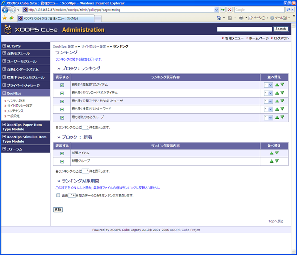

### 1.10. ランキング {#1-10}

ランキングの表示に関する設定です。

*   ブロック：ランキング

    表示するの項目にチェックを入れると、その項目が表示されるようになります。

    並べ替えの三角で表示順の並べ替えが出来ます。ドロップダウンリストで4段分まで一度に上下することも可能です。

    _2を選んで上三角をクリックすれば、項目は2つ分上に移動します。_

    各ランキングの上位何件まで表示するかを決定できます。

*   ブロック：新着

    新着情報の表示に関する設定です。

    各新着情報の上位何件まで表示するかを決定できます。

*   ランキング対象期間

    ランキング対象期間の設定

    チェックボックスにチェックを入れた場合、その期間のファイルはランキングに反映されません。

**Figure 4.15. ランキング設定**