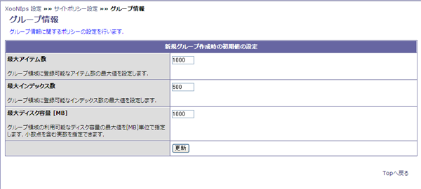

### 1.3. グループ情報 {#1-3}

グループ領域に登録できるアイテム数やHDDの使用量の上限を設定出来ます。

**Table 4.4. 新規グループ作成時の初期値の設定**

| 項目 | 説明 |
| :-- | :-- |
| 最大アイテム数 | Group(グループ領域)に登録出来るアイテムの上限数を指定します。 |
| 最大インデックス数 | Group(グループ領域)に登録出来るインデックスの数を指定します。 |
| 最大ディスク容量 | Group(グループ領域)で使用されるHDDの最大容量をMB単位で指定します。 |

**Figure 4.3. グループ設定**