### 2.4. アイテム管理 {#2-4}

#### 2.4.1. アイテム登録 {#2-4-1}

アイテムの登録方法を説明します。

XooNIps User Menuから新規アイテム登録のリンクをクリックします。

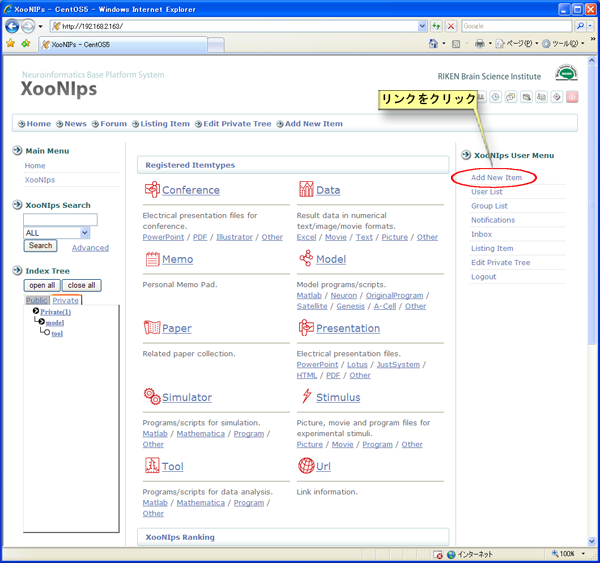

**Figure 5.25. アイテムの新規登録**

画面中央のドロップダウンリストから登録したいアイテムタイプを選択します。

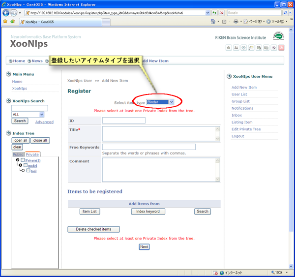

**Figure 5.26. 新規登録アイテムタイプの選択**

アイテムタイプを選ぶと登録画面が表示されます。

少なくとも一つの登録したいPrivate index keywordにチェックを付けます。

赤色の＊は必須入力項目です。

IDの項目はXooNIps内で固有の一意の値である必要があります。IDが重複する場合はエラーとなります。

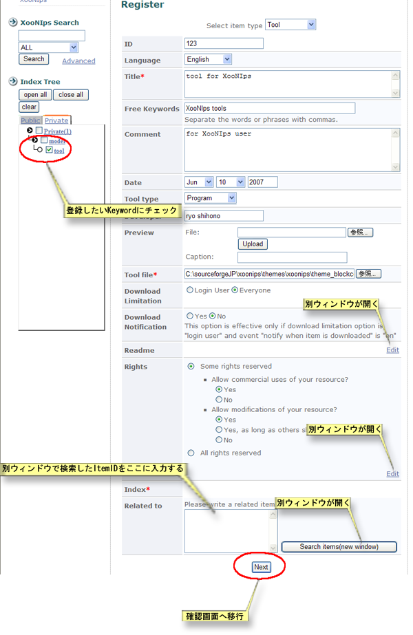

**Figure 5.27. アイテムの登録 (TOOL)**

*   ダウンロード制限

    このアイテムをダウンロードできるユーザーをログインユーザーに限定するか、ゲストも含めた全てのユーザーにダウンロードを許可するかを選択します。

*   ダウンロード通知

    上記オプションでログインユーザーを選択した場合のみ有効なオプションとなります。

    通知の設定はサイトのシステム設定に依存します。

*   Readme入力ウィンドウ

    Readmeの編集リンクをクリックすると、別のウィンドウが開きます。ファイルを指定して「更新」ボタンを押すか、テキストボックスへの直接入力した後「OK」ボタンを押すと登録画面に反映されます

    

    **Figure 5.28. Readmeの入力**

*   Rights

    Creative Commonsライセンスの設定が出来ます。編集のリンクをクリックすると別ウィンドウが開きますので、独自のライセンスを設定することも可能です。

    Rights入力ウィンドウ

    RightsのEditリンクをクリックすると、別のウィンドウが開きます。ファイルを指定して「更新」ボタンを押すか、テキストボックスへの直接入力した後「OK」を押すと登録画面に反映されます。

    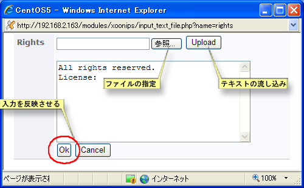

    **Figure 5.29. Rightsの入力**

*   関連アイテム

    関連するアイテムを指定することが出来ます。

    関連アイテムに登録するアイテムを指定する方法は以下の3通りです。

    *   アイテム一覧

        アイテムの一覧から選択します。

    *   インデックスキーワード

        Index Treeを利用して関連アイテムに登録するアイテムを選択します。

    *   検索

        詳細検索を利用して関連アイテムに登録するアイテムを選択します。

    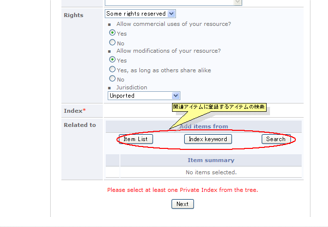

    **Figure 5.30. アイテム登録画面**

    1.  アイテム一覧での選択

        登録可能なアイテム(Public Indexに登録されているアイテムとユーザーのPrivate Indexに登録されているアイテム)の一覧から選択します。

        登録するアイテムにチェックを付けた後、「選択する」ボタンを押して確定します。

        

        **Figure 5.31. アイテム登録画面アイテム一覧**

    2.  インデックスキーワードでの選択

        ドロップダウンリストでアイテム一覧を表示して、関連アイテムに登録するアイテムを選択します。

        登録するアイテムにチェックを付けた後、「選択する」ボタンを押して確定します。

        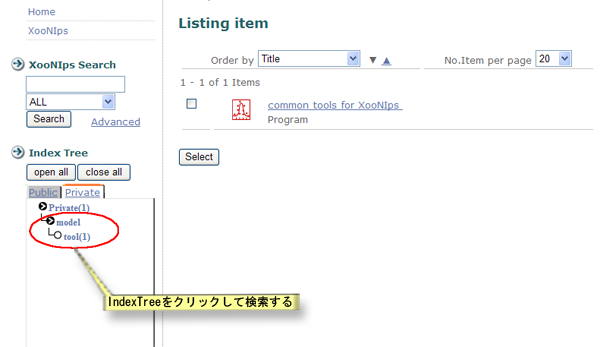

        **Figure 5.32. アイテム登録画面インデックスキーワード**

    3.  検索での選択

        詳細検索画面が表示されますので、通常の詳細検索と同様に関連アイテムに登録したいアイテムを検索します。

        登録するアイテムにチェックを付けた後、「選択する」ボタンを押して確定します。

    「次へ」ボタンを押して登録します。

    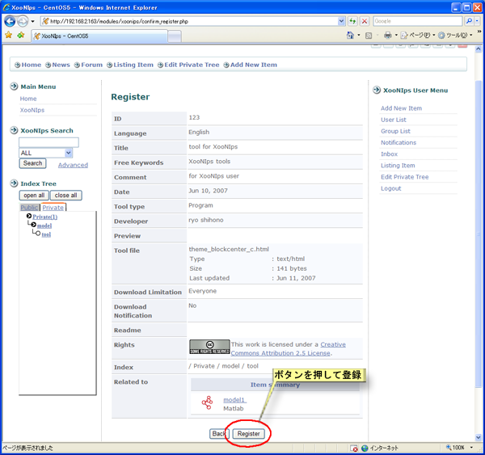

    **Figure 5.33. アイテム登録確認画面**

#### 2.4.2. アイテムの編集 {#2-4-2}

Index TreeやXooNIps検索を利用して編集したいアイテムの詳細画面を表示させます。

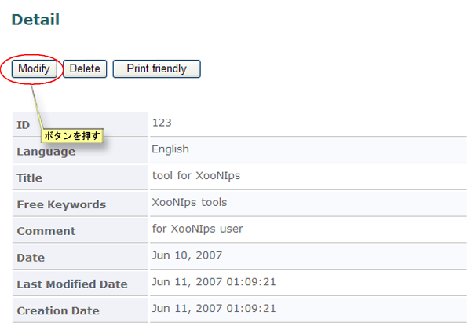

**Figure 5.34. アイテム詳細**

編集画面が表示されますので、項目を修正して「更新」ボタンを押して情報を反映させます。

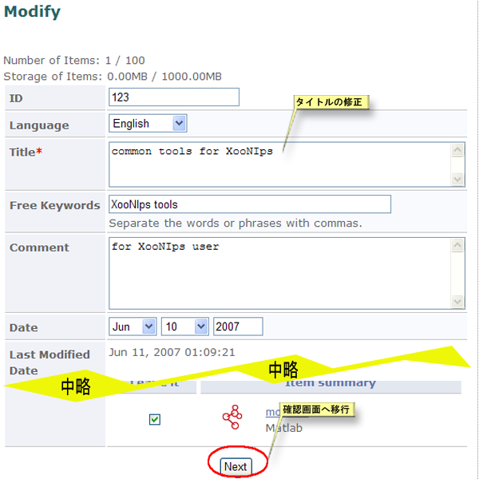

**Figure 5.35. アイテム修正**

詳細画面では変更履歴が表示されます。

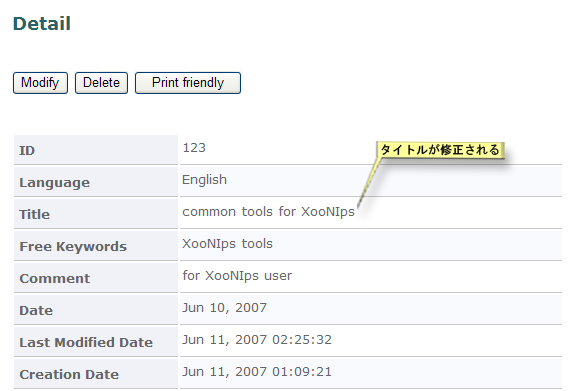

**Figure 5.36. アイテム更新履歴**

#### 2.4.3. アイテム削除 {#2-4-3}

アイテムの削除

Index TreeやXooNIps検索を利用して削除したいアイテムの詳細画面を表示させます。

「削除」ボタンを押すと、確認のダイヤログが表示されますので「はい」を選択して削除します。

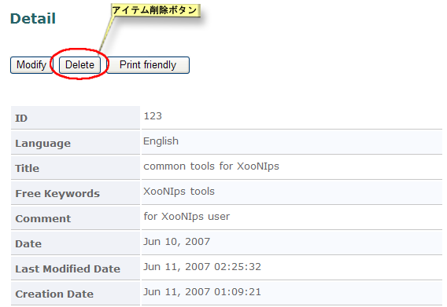

**Figure 5.37. アイテム削除**

#### 2.4.4. Binderアイテムタイプについて {#2-4-4-binder}

Binderは他のアイテムを一つにまとめて管理することが出来るアイテムタイプです。

Binderに登録するアイテムを指定する方法は以下の3通りです。

*   アイテム一覧

    アイテムの一覧から選択します。

*   インデックスキーワード

    Index Treeを利用してBinderに登録するアイテムを選択します。

*   検索

    詳細検索を利用してBinderに登録するアイテムを選択します。

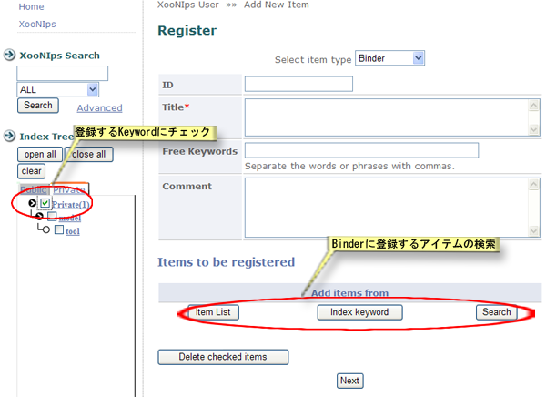

**Figure 5.38. Binder登録画面**

1.  アイテム一覧での選択

    登録可能なアイテム(Public Indexに登録されているアイテムとユーザーのPrivate Indexに登録されているアイテム)の一覧から選択します。

    登録するアイテムにチェックを付けた後、「選択する」ボタンを押して確定します。

    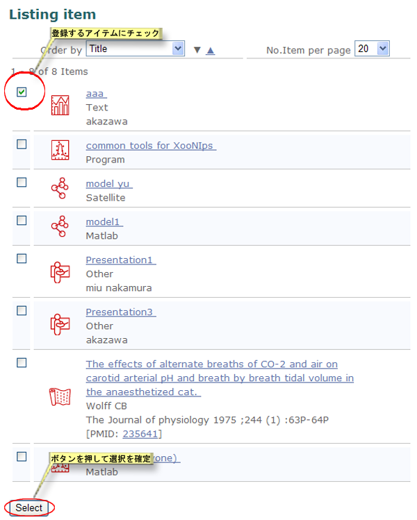

    **Figure 5.39. Binder登録画面アイテム一覧**

2.  インデックスキーワードでの選択

    ドロップダウンリストでアイテム一覧を表示して、Binderに登録するアイテムを選択します。

    登録するアイテムにチェックを付けた後、「選択する」ボタンを押して確定します。

    

    **Figure 5.40. Binder登録画面インデックスキーワード**

3.  検索での選択

    詳細検索画面が表示されますので、通常の詳細検索と同様にBinderに登録したいアイテムを検索します。

    登録するアイテムにチェックを付けた後、「選択する」ボタンを押して確定します。

「次へ」ボタンを押して登録します。

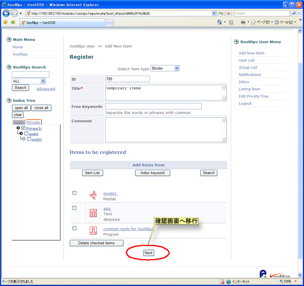

**Figure 5.41. Binder登録確認画面**

#### 2.4.5. Paperアイテムタイプの登録 {#2-4-5-paper}

Paperアイテムの登録画面にはPubMedIDの項目があります。PubMedIDがわかっている場合にはPubMedIDを入力して「Complete」ボタンを押すとその他の情報が自動で補完されます。

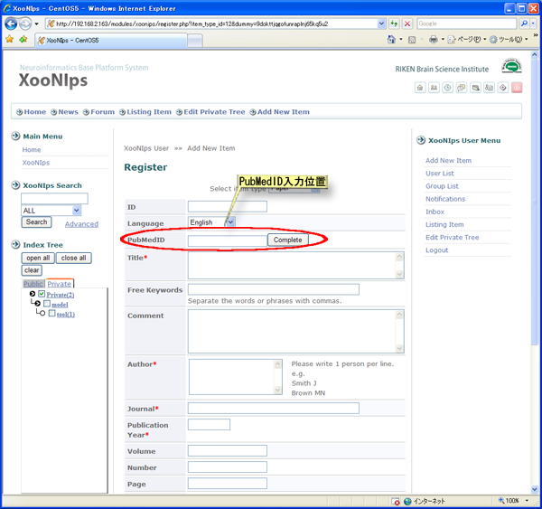

**Figure 5.42. Paper登録画面**

#### 2.4.6. Bookアイテムタイプの登録 {#2-4-6-book}

Bookアイテムの登録画面にはISBNコードの項目があります。ISBNコード(10桁又は13桁)がわかっている場合にはISBNコード(10桁又は13桁)を入力して「Complete」ボタンを押すとその他の情報が自動で補完されます。その際のURLにはamazonの書籍情報詳細ページが補完されます。

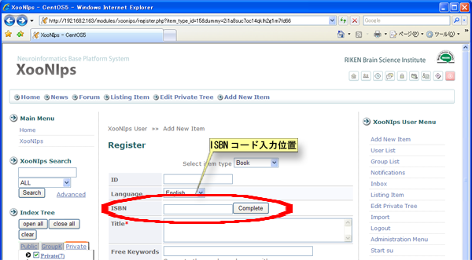

**Figure 5.43. Book登録画面**