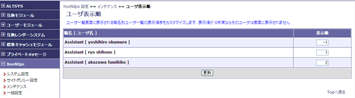
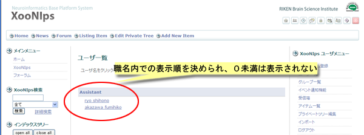

### 2.4. ユーザ表示順 {#2-4}

表示順の項目に職名内での表示順を設定して更新ボタンを押すことによって変更が反映されます。

表示順が0未満ならそのユーザーは表示されません。

ここでの表示順設定は職名内でのみ有効となります。

**Figure 4.25. ユーザ表示順**

表示結果はホームページのXooNIpsメニューのユーザ一覧から確認出来ます。

**Figure 4.26. ユーザ表示順2**